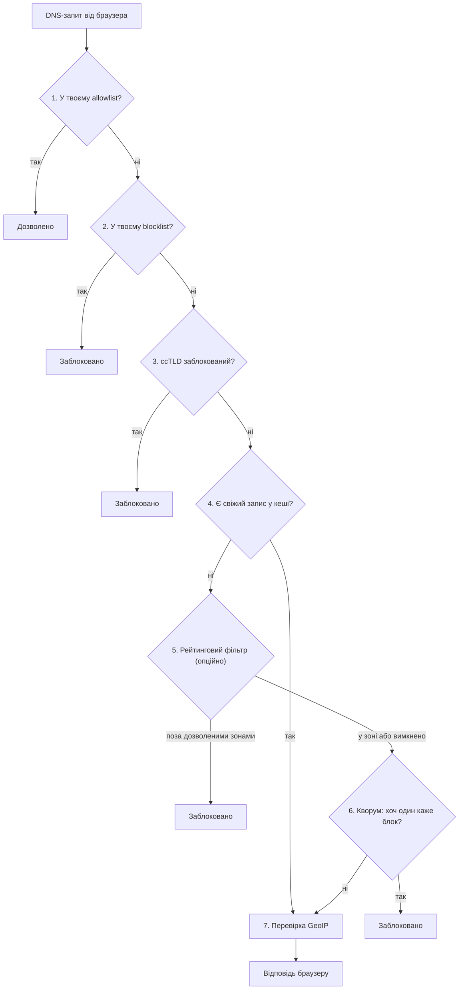

Локальний DNS-over-HTTPS фільтр, що приймає рішення про блокування за принципом **кворуму**
незалежних провайдерів, а не довіряє одному.

[](https://github.com/user137/dns-quorum-filter/actions/workflows/ci.yml)
[](LICENSE)


[`SPEC.md`](SPEC.md) · [`SERVICES.md`](SERVICES.md) · [`CONFIGURATION.md`](CONFIGURATION.md) · [`SECURITY.md`](SECURITY.md)

* * *

Кросплатформний застосунок, що піднімає локальний DoH-сервер на `127.0.0.1`. Браузер (через
вбудовану опцію "Custom DoH provider") відправляє всі DNS-запити на цей локальний сервер, який
опитує **паралельно** кілька публічних фільтруючих DNS-провайдерів (з коробки — Quad9,
Cloudflare Malware та AdGuard DNS; список редагується) і блокує домен, якщо **хоч один** з них
каже "блок" (OR-логіка). Один скомпрометований чи помилковий
провайдер не пропускає загрозу — але й не може одноосібно вирішувати, що заблоковано.

## Довіра й приватність — без замовчувань

- **TLS-сертифікат локального сервера — самопідписаний лист, ніколи не локальний CA**
  (SPEC.md §2). Це навмисно найбільша поверхня атаки проєкту, назва якої не приховується: якщо
  ключ CA скомпрометовано — можна підробити TLS будь-якого сайту; якщо ключ листового
  сертифіката — можна підробити лише `127.0.0.1`. Другий сценарій істотно вужчий, тому обрано
  саме його, ціною того, що сертифікат треба довіряти вручну для кожного профілю браузера (T-49,
  ще не автоматизовано — [`SERVICES.md`](SERVICES.md)).
- **Блокування — це `0.0.0.0`/`::` (NULL), ніколи NXDOMAIN**, для A/AAAA-записів (SPEC.md §3.2).
  NXDOMAIN у деяких браузерах провокує тихий fallback на інший резолвер — тобто саме той спосіб
  "обходу" фільтра, якого цей дизайн навмисно уникає.

> **Компроміс приватності, свідомий і незамовчуваний**: щоб отримати кворум, кожен запит
> надсилається одразу кільком третім сторонам (Quad9, AdGuard DNS та ін.), а не одному
> резолверу. Це означає, що більше сторонніх сервісів бачить непошифровану історію переглядів
> домену в обмін на ширше покриття загроз. Ця умова свідомо лишається видимою користувачу
> в UI, а не прихованою в налаштуваннях (SPEC.md §"Наскрізні вимоги").

## Що це — і що ні

Це мережевий (DNS-рівень) фільтр, **не** конкурент uBlock Origin — немає element-picker чи
cosmetic filtering, це не заміна розширенню браузера. Ціль — malware/phishing/adult/ads на рівні
резолюції домену, покриваючи більше через кілька незалежних джерел threat-intelligence замість
одного провайдера.

Дві альтернативи, які розглядались і були відхилені (повне обґрунтування —
SPEC.md §"Чому саме такий дизайн"):
- **Розширення браузера з живим блокуванням** — Manifest V3 `declarativeNetRequest` не може
  синхронно заблокувати запит за результатом асинхронного DoH-лукапу; лише Firefox досі дозволяє
  блокуючий `webRequest`.
- **System-wide DNS override (`127.0.0.1:53`)** — немає надійної крос-платформної гарантії
  відновлення після краху, особливо на Windows (немає OS-примітиву на кшталт macOS Network
  Extension).

## Як працює фільтрація

Кожен DNS-запит проходить одну й ту саму послідовність перевірок, зверху вниз — щойно якась
із них дає остаточну відповідь, решта не опитуються:

1. **Твій allowlist** — домен у ньому? Дозволено, і крапка.
2. **Твій blocklist** — домен у ньому? Заблоковано, без жодного мережевого запиту.
3. **Блок за доменною зоною країни (ccTLD)** — якщо ти сам налаштував такий список.
4. **Кеш** — цей домен уже перевірявся нещодавно? Відповідь береться з пам'яті.
5. **Рейтинговий фільтр** (опційно, вимкнено за замовчуванням) — "показувати лише перевірені
   сайти": домен поза дозволеними зонами блокується тут.
6. **Кворум** — головний механізм: кілька незалежних публічних DNS-провайдерів (Quad9,
   AdGuard тощо) питаються **паралельно**, і досить, щоб **хоч один** сказав "блок".
7. **Перевірка за країною (GeoIP)** — якщо відповідь дозволена, її IP звіряється зі списком
   заблокованих країн.



Це спрощення для першого знайомства. Точний порядок і повне обґрунтування кожного кроку —
SPEC.md §5.3.

* * *

## Статус

Фаза 1 (PoC) формально закрита 2026-08-29; Фаза 2 (автоматизація сертифіката, Windows) —
2026-08-31; Фаза 3 (production hardening: watchdog, MSIX-пакування, повне видалення) — 2026-09-06
(реліз [`v0.3.0`](https://github.com/user137/dns-quorum-filter/releases/tag/v0.3.0), test-signed);
**Фаза 4 (рейтинговий фільтр «бульбашка» + курований топ-N по країнах + державні/науково-освітні
й персональний навчений зонові джерела) закрита повністю 2026-09-11** — тег `v0.4.0` (Батч 4.6,
бамп `0.3.1` → `0.4.0`; T-190/`v0.3.2` онбординг-майстер свідомо не тегувався окремо, злитий сюди
— DECISIONS.md 2026-09-11) → чернетка релізу, публікацію (та ручний чистий MSIX-прогін) робить
людина. Поставлено з Фази 3: watchdog-процес зі взаємним heartbeat (`dnsqb-watcher`), опційне
шифроване збереження логу й кешу, `.msix`-пакет для одноклікового встановлення
("[Встановлення (MSIX)](#встановлення-msix)" нижче) з in-app «Повністю видалити», майстер першого
запуску (T-188) + per-браузер картка налаштування (T-189). З Фази 4: опційний (default-off)
рейтинговий фільтр, що блокує домени поза обраними країнами/глобальним топ-N/держ./науково-освітніми
зонами/особисто навченим списком — ніколи не форс-дозволяє, лише звужує. **Обидва Ф1-розриви, що
переносились без номера батчу, закриті:** метрики — T-174/T-175 (2026-09-05/06: кворум +6.3 pp
над найсильнішим одиночним провайдером на n=111 malware-доменів, гіпотезу підтверджено); живий
прохід через реально налаштований Chrome Custom DoH provider — T-172 (2026-09-06, дискримінантний
негативний контроль — див. секцію «Перевірка: браузер → локальний DoH» нижче). Живий, детальний
статус по кожному зрізу роботи — [`CLAUDE.md`](CLAUDE.md), розділ "Project state"; повний
фазований план — SPEC.md.

## Workspace

```
crates/
  dnsqb-service/   # DoH-сервер + quorum-резолвер + GeoIP + admin-канал (Фази 1–2)
  dnsqb-tray/      # трей-іконка + меню (сертифікат, restart, stop, повне видалення)
  dnsqb-watcher/   # watchdog: взаємний heartbeat, автовідновлення, ідемпотентний запуск (Фаза 3)
```

## Встановлення (MSIX)

Кожен реліз (сторінка [Releases](https://github.com/user137/dns-quorum-filter/releases)) несе
`dns-quorum-filter.msix` — Start-menu плитка й автозапуск (Параметри → Застосунки →
Автозавантаження) одним пакетом, а не голі `.exe`. Поки що це **sideload-пакет**, не
Store-лістинг (T-156, Батч 3.8):

1. Завантаж `dns-quorum-filter.msix`, `dns-quorum-filter.cer` і `Trust-TestCert.ps1` в одну теку
   й запусти хелпер (сам попросить підвищення прав, довірить серт у `LocalMachine\TrustedPeople`
   і поставить пакет):
   ```powershell
   .\Trust-TestCert.ps1 -Install
   ```
   Вручну (підвищена PowerShell-сесія): `Import-Certificate -FilePath dns-quorum-filter.cer
   -CertStoreLocation Cert:\LocalMachine\TrustedPeople` — саме це сховище перевіряє
   `Add-AppxPackage` (`Cert:\CurrentUser\...` → `0x800B0109`, відсутній серт → `0x800B010A`;
   `LocalMachine\Root` сам по собі недостатній). Це **інший** сертифікат, ніж той, що застосунок
   ставить для `127.0.0.1` DoH-трафіку (T-49) — довіра до одного не означає довіру до іншого.
2. Якщо не через `-Install`: `Add-AppxPackage dns-quorum-filter.msix`.
3. Вкажи в браузері той самий `https://127.0.0.1:<port>/dns-query` як кастомний DoH-провайдер
   — крок і чесне застереження щодо нього в "[Швидкий старт](#швидкий-старт-збірка-з-джерел)"
   нижче, крок 4-5 (те саме для встановлення з джерел і з MSIX).

Перед видаленням застосунку — трей → «Повністю видалити» (або `/admin/ui` → «Розширені
налаштування» → «Повне видалення»): MSIX не запускає жодного коду при видаленні пакета, тож
збережені ключі треба прибрати самому, до, а не після видалення (T-70). Довіру тест-сертифіката
знімає `.\Trust-TestCert.ps1 -Remove`.

## Швидкий старт (збірка з джерел)

1. Встанови Rust, якщо його ще нема — [rustup.rs](https://rustup.rs) (стандартний спосіб для
   Windows).
2. Зібрати й запустити:
   ```
   cargo build --workspace
   cargo run -p dnsqb-service
   ```
   Сервіс підніме `https://127.0.0.1:<port>/dns-query` (порт і дефолт —
   [`CONFIGURATION.md`](CONFIGURATION.md)) і згенерує self-signed сертифікат при першому
   запуску.
3. Довірити сертифікат (T-49; для MSIX-збірки — майстер першого запуску трея пропонує це
   автоматично, T-188). Поза MSIX: трей → «Встановити сертифікат», або hero-кнопка на
   `/admin/ui` («Сертифікат не встановлено» → «Встановити сертифікат»).
4. Вказати `https://127.0.0.1:<port>/dns-query` як кастомний DoH-провайдер. Саме
   налаштування — загальновідома, стандартна функція браузера, а не щось специфічне для
   цього проєкту:
   - **Chrome / Edge / Brave / Opera:** `chrome://settings/security` (Edge:
     `edge://settings/privacy`, Brave: `brave://settings/security`) → «Використовувати
     безпечний DNS» → «Власний».
   - **Firefox:** `about:preferences#privacy` → «DNS через HTTPS» → «Максимальний захист» →
     «Обрати постачальника» → «Власний».

   Ці кроки, з кнопкою «Копіювати» для адреси й покроковою інструкцією **саме для вашого
   браузера** (визначається за `navigator.userAgent`, T-189), також є на сторінці `/admin/ui`
   — секція «Підключення браузера» (при першому відкритті розгорнута вгорі).
5. Перевірити, що сервіс живий — відкрити `https://127.0.0.1:<port>/admin/ui` **напряму** в
   браузері (не через щойно вказаний кастомний DoH). Hero-статус угорі сторінки показує
   «Захищено» / «Не захищено». Що браузер справді резолвить домени саме через цю службу —
   перевіряється окремо (кнопка «Запустити перевірку» в тій самій секції, або вручну — див.
   «Перевірка: браузер → локальний DoH» нижче).

Повний опис обох бінарників, їх поведінки при старті й логів — [`SERVICES.md`](SERVICES.md);
формат обох конфігураційних TOML-файлів — [`CONFIGURATION.md`](CONFIGURATION.md).

`cargo test --workspace --lib` — юніт-тести; повний список команд і CI-гейтів —
[`CLAUDE.md`](CLAUDE.md), розділ "Project state".

* * *

## Перевірка: браузер → локальний DoH

Що браузер справді ганяє DNS через цю службу, а не повз неї — доводить **негативний контроль**:
блокуємо домен локально й дивимось, чи браузер реально впав саме на цьому. Просто «сайт
відкрився» цього не доводить (він міг відкритись через системний резолвер).

1. **Сервіс запущено**, cert браузером довірено (кроки вище). `https://127.0.0.1:<port>/admin/ui`
   відкривається без попередження.
2. **Chrome → `chrome://settings/security` → «Використовувати безпечний DNS» → «Власний»** →
   вставити `https://127.0.0.1:<port>/dns-query`. Це режим `secure` — Chrome **не** робить
   тихого fallback на системний резолвер (на відміну від enterprise-політики `automatic`). Не
   лишати «ОС за умовчанням».
3. **Санітарна перевірка:** відкрити будь-який звичайний сайт → у `/admin/ui` (вкладка Log) або
   `GET /admin/log` має з'явитися рядок `QUORUM`/`CACHE` `ALLOWED` для цього домену (а також
   для доменів, яких ти не вводив — напр. `www.google.com` connectivity-проби Chrome).
4. **Негативний контроль:** додати домен у blocklist — `/admin/ui` картка Overrides, або
   `POST /admin/overrides/add` `{"pattern":"<домен>","list":"blocklist"}`. Запам'ятати час.
5. `chrome://net-internals/#dns` → **Clear host cache**, потім відкрити той домен.
6. **Підтвердити разом:**
   - Chrome показує **`ERR_ADDRESS_INVALID`** / «Немає зв'язку із сайтом» (не
     `ERR_NAME_NOT_RESOLVED` — це означало б, що резолв взагалі не дійшов; `ERR_ADDRESS_INVALID` =
     домен зарезолвився у `0.0.0.0` і з'єднання впало на рівні адреси);
   - у `/admin/log` — рядок `BLOCKLIST` `BLOCKED` для цього домену з таймстемпом усередині
     вікна кліку.
7. Прибрати запис із blocklist, повернути DNS-налаштування браузера.

Збіг «браузерний фейл на address-invalid цілі» + «корельований у часі `BLOCKLIST`-рядок»
доводить, що резолюцію зробив саме браузер через службу. Зафіксовано 2026-09-06 (T-172): Chrome
152, `mode=secure`, `neverssl.com` — до блокування `QUORUM`/`ALLOWED`, після — `ERR_ADDRESS_INVALID`
+ `BLOCKLIST`-рядки на `A` та `HTTPS_SVCB` протягом ~32 с.

* * *

## Документація

| Файл | Зміст |
|---|---|
| [`SPEC.md`](SPEC.md) | Технічний спек: архітектура, обґрунтування рішень, таблиця RFC-відповідності, фазований план, відкриті питання. |
| [`SERVICES.md`](SERVICES.md) | Що робить кожен бінарник, як запускати, логи, відомі прогалини. |
| [`CONFIGURATION.md`](CONFIGURATION.md) | Повний довідник по обох TOML-файлах конфігурації. |
| [`UI-SPEC.md`](UI-SPEC.md) | GUI: екранний inventory, поля/типи по екрану, DTO для admin HTTP-каналу (не Tauri — той канал видалений T-149); мокап у [`mockups/`](mockups/). |
| [`TASKS.md`](TASKS.md) / [`TASKS-DONE.md`](TASKS-DONE.md) | Поточний і завершений backlog. |
| [`DECISIONS.md`](DECISIONS.md) | Журнал ретроактивних архітектурних рішень. |
| [`SECURITY.md`](SECURITY.md) | Модель загроз, жорсткі обмеження, таблиця ветингу залежностей. |
| [`PERFORMANCE.md`](PERFORMANCE.md) | Аналіз складності критичних ділянок конвеєра, методологія й результати навантажувального тесту. |
| [`diagrams/`](diagrams/) | Діаграми архітектури й UI. |

## Стек

| Компонент | Крейт |
|---|---|
| Async runtime | `tokio` |
| DNS wire format | `hickory-dns` |
| DoH-сервер | `hyper` |
| Upstream HTTP-клієнт | `reqwest` |
| TLS | `rustls` |
| Кеш (per-entry TTL) | `moka` |
| GeoIP | `maxminddb` |
| UI | Трей-індикатор (`tray-icon`/`tao`/`rfd`) + вбудований веб-UI на `dnsqb-service`'s адмін-каналі |
| Watchdog (взаємний heartbeat, авто-рестарт) | `dnsqb-watcher`, власний код + `sysinfo` для PID-перевірки |
| MSIX-пакування | Windows SDK (`makeappx`/`signtool`), без нового Rust-крейту |
| Fuzz/property tests | `proptest` |

Деталі й обґрунтування вибору кожного компонента — SPEC.md, розділ "Технічний стек".

* * *

## Ліцензія

[Apache License 2.0](LICENSE).
