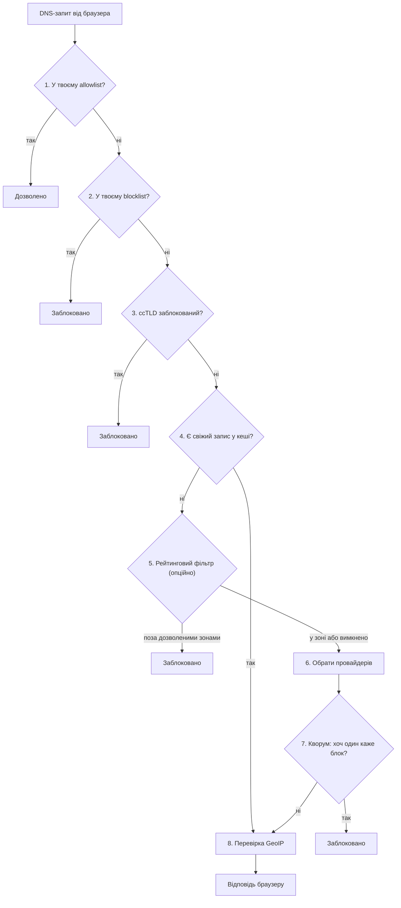

Локальний DNS-over-HTTPS фільтр, що приймає рішення про блокування за принципом **кворуму**
незалежних провайдерів, а не довіряє одному.

[](https://github.com/user137/dns-quorum-filter/actions/workflows/ci.yml)
[](LICENSE)


[`SPEC.md`](SPEC.md) · [`SERVICES.md`](SERVICES.md) · [`CONFIGURATION.md`](CONFIGURATION.md) · [`SECURITY.md`](SECURITY.md)

* * *

Кросплатформний застосунок, що піднімає локальний DoH-сервер на `127.0.0.1`. Браузер (через
вбудовану опцію "Custom DoH provider") відправляє всі DNS-запити на цей локальний сервер, який
опитує **паралельно** кілька публічних фільтруючих DNS-провайдерів (Quad9, AdGuard DNS та ін.) і
блокує домен, якщо **хоч один** з них каже "блок" (OR-логіка). Один скомпрометований чи помилковий
провайдер не пропускає загрозу — але й не може одноосібно вирішувати, що заблоковано.

## Довіра й приватність — без замовчувань

- **TLS-сертифікат локального сервера — самопідписаний лист, ніколи не локальний CA**
  (SPEC.md §2). Це навмисно найбільша поверхня атаки проєкту, назва якої не приховується: якщо
  ключ CA скомпрометовано — можна підробити TLS будь-якого сайту; якщо ключ листового
  сертифіката — можна підробити лише `127.0.0.1`. Другий сценарій істотно вужчий, тому обрано
  саме його, ціною того, що сертифікат треба довіряти вручну для кожного профілю браузера (T-49,
  ще не автоматизовано — [`SERVICES.md`](SERVICES.md)).
- **Блокування — це `0.0.0.0`/`::` (NULL), ніколи NXDOMAIN**, для A/AAAA-записів (SPEC.md §3.2).
  NXDOMAIN у деяких браузерах провокує тихий fallback на інший резолвер — тобто саме той спосіб
  "обходу" фільтра, якого цей дизайн навмисно уникає.

> **Компроміс приватності, свідомий і незамовчуваний**: щоб отримати кворум, кожен запит
> надсилається одразу кільком третім сторонам (Quad9, AdGuard DNS та ін.), а не одному
> резолверу. Це означає, що більше сторонніх сервісів бачить непошифровану історію переглядів
> домену в обмін на ширше покриття загроз. Ця умова свідомо лишається видимою користувачу
> в UI, а не прихованою в налаштуваннях (SPEC.md §"Наскрізні вимоги").

## Що це — і що ні

Це мережевий (DNS-рівень) фільтр, **не** конкурент uBlock Origin — немає element-picker чи
cosmetic filtering, це не заміна розширенню браузера. Ціль — malware/phishing/adult/ads на рівні
резолюції домену, покриваючи більше через кілька незалежних джерел threat-intelligence замість
одного провайдера.

Дві альтернативи, які розглядались і були відхилені (повне обґрунтування —
SPEC.md §"Чому саме такий дизайн"):
- **Розширення браузера з живим блокуванням** — Manifest V3 `declarativeNetRequest` не може
  синхронно заблокувати запит за результатом асинхронного DoH-лукапу; лише Firefox досі дозволяє
  блокуючий `webRequest`.
- **System-wide DNS override (`127.0.0.1:53`)** — немає надійної крос-платформної гарантії
  відновлення після краху, особливо на Windows (немає OS-примітиву на кшталт macOS Network
  Extension).

## Як працює фільтрація

Кожен DNS-запит проходить одну й ту саму послідовність перевірок, зверху вниз — щойно якась
із них дає остаточну відповідь, решта не опитуються:

1. **Твій allowlist** — домен у ньому? Дозволено, і крапка.
2. **Твій blocklist** — домен у ньому? Заблоковано, без жодного мережевого запиту.
3. **Блок за доменною зоною країни (ccTLD)** — якщо ти сам налаштував такий список.
4. **Кеш** — цей домен уже перевірявся нещодавно? Відповідь береться з пам'яті.
5. **Рейтинговий фільтр** (опційно, вимкнено за замовчуванням) — "показувати лише перевірені
   сайти": домен поза дозволеними зонами блокується тут.
6. **Вибір провайдерів** — для дуже популярних доменів питаються лише "безпекові" провайдери
   (менше зайвих запитів до третіх сторін), для решти — всі, які ти увімкнув.
7. **Кворум** — головний механізм: кілька незалежних публічних DNS-провайдерів (Quad9,
   AdGuard тощо) питаються **паралельно**, і досить, щоб **хоч один** сказав "блок".
8. **Перевірка за країною (GeoIP)** — якщо відповідь дозволена, її IP звіряється зі списком
   заблокованих країн.



Це спрощення для першого знайомства. Точний порядок і повне обґрунтування кожного кроку —
SPEC.md §5.3.

* * *

## Статус

Фаза 1 (PoC) формально закрита 2026-08-29; Фаза 2 (автоматизація сертифіката, Windows) —
2026-08-31; **Фаза 3 (production hardening: watchdog, MSIX-пакування, повне видалення) формально
закрита 2026-09-04.** Поставлено: watchdog-процес зі взаємним heartbeat (`dnsqb-watcher`),
опційне шифроване збереження логу й кешу, `.msix`-пакет для одноклікового встановлення
("[Встановлення (MSIX)](#встановлення-msix)" нижче) з in-app «Повністю видалити». Лишились
**два Ф1-розриви, перенесені без номера батчу**: живий прохід через реально налаштований
Chrome Custom DoH provider не зафіксовано, і метрики (T-66) не підтвердили приріст кворуму над
найкращим одиночним провайдером. Живий, детальний статус по кожному зрізу роботи —
[`CLAUDE.md`](CLAUDE.md), розділ "Project state"; повний фазований план — SPEC.md.

## Workspace

```
crates/
  dnsqb-service/   # DoH-сервер + quorum-резолвер + GeoIP + admin-канал (Фази 1–2)
  dnsqb-tray/      # трей-іконка + меню (сертифікат, restart, stop, повне видалення)
  dnsqb-watcher/   # watchdog: взаємний heartbeat, автовідновлення, ідемпотентний запуск (Фаза 3)
```

## Встановлення (MSIX)

Кожен реліз (сторінка [Releases](https://github.com/user137/dns-quorum-filter/releases)) несе
`dns-quorum-filter.msix` — Start-menu плитка й автозапуск (Параметри → Застосунки →
Автозавантаження) одним пакетом, а не голі `.exe`. Поки що це **sideload-пакет**, не
Store-лістинг (T-156, Батч 3.8):

1. Довірити тест-сертифікат (**один раз**, потрібна підвищена PowerShell-сесія — підтверджено
   емпірично, `Cert:\CurrentUser\...` недостатньо):
   ```powershell
   Import-Certificate -FilePath dns-quorum-filter.cer -CertStoreLocation Cert:\LocalMachine\Root
   ```
   Це **інший** сертифікат, ніж той, що застосунок ставить для `127.0.0.1` DoH-трафіку (T-49) —
   довіра до одного не означає довіру до іншого.
2. `Add-AppxPackage dns-quorum-filter.msix`.
3. Вкажи в браузері той самий `https://127.0.0.1:<port>/dns-query` як кастомний DoH-провайдер
   — крок і чесне застереження щодо нього в "[Швидкий старт](#швидкий-старт-збірка-з-джерел)"
   нижче, крок 4-5 (те саме для встановлення з джерел і з MSIX).

Перед видаленням застосунку — трей → «Повністю видалити» (або `/admin/ui`, секція «Повне
видалення»): MSIX не запускає жодного коду при видаленні пакета, тож прибрати довірений
сертифікат і збережені ключі треба самому, до, а не після видалення (T-70).

## Швидкий старт (збірка з джерел)

1. Встанови Rust, якщо його ще нема — [rustup.rs](https://rustup.rs) (стандартний спосіб для
   Windows).
2. Зібрати й запустити:
   ```
   cargo build --workspace
   cargo run -p dnsqb-service
   ```
   Сервіс підніме `https://127.0.0.1:<port>/dns-query` (порт і дефолт —
   [`CONFIGURATION.md`](CONFIGURATION.md)) і згенерує self-signed сертифікат при першому
   запуску. Довірений сертифікат вручну потрібно імпортувати у профіль браузера самостійно —
   автоматичного кроку ще немає (T-49).
3. Довірити сертифікат у профілі браузера (T-49, ще ручний крок).
4. Вказати `https://127.0.0.1:<port>/dns-query` як кастомний DoH-провайдер. Саме
   налаштування — загальновідома, стандартна функція браузера, а не щось специфічне для
   цього проєкту (наприклад, у Chrome: Налаштування → Конфіденційність і безпека → Безпека →
   «Використовувати безпечний DNS» → «Власний»).
5. Перевірити, що сервіс живий — відкрити `https://127.0.0.1:<port>/admin/ui` **напряму** в
   браузері (не через щойно вказаний кастомний DoH). **Це і є межа перевіреного в цьому
   проєкті**: живого, автоматично підтвердженого проходу "браузер справді резолвить домени
   саме через цю службу" тут ще нема — відкритий розрив Фази 1, див. "Статус" вище й
   [`CLAUDE.md`](CLAUDE.md).

Повний опис обох бінарників, їх поведінки при старті й логів — [`SERVICES.md`](SERVICES.md);
формат обох конфігураційних TOML-файлів — [`CONFIGURATION.md`](CONFIGURATION.md).

`cargo test --workspace --lib` — юніт-тести; повний список команд і CI-гейтів —
[`CLAUDE.md`](CLAUDE.md), розділ "Project state".

* * *

## Документація

| Файл | Зміст |
|---|---|
| [`SPEC.md`](SPEC.md) | Технічний спек: архітектура, обґрунтування рішень, таблиця RFC-відповідності, фазований план, відкриті питання. |
| [`SERVICES.md`](SERVICES.md) | Що робить кожен бінарник, як запускати, логи, відомі прогалини. |
| [`CONFIGURATION.md`](CONFIGURATION.md) | Повний довідник по обох TOML-файлах конфігурації. |
| [`UI-SPEC.md`](UI-SPEC.md) | GUI: екранний inventory, поля/типи по екрану, DTO, чернетка Tauri-команд; мокап у [`mockups/`](mockups/). |
| [`TASKS.md`](TASKS.md) / [`TASKS-DONE.md`](TASKS-DONE.md) | Поточний і завершений backlog. |
| [`DECISIONS.md`](DECISIONS.md) | Журнал ретроактивних архітектурних рішень. |
| [`SECURITY.md`](SECURITY.md) | Модель загроз, жорсткі обмеження, таблиця ветингу залежностей. |
| [`diagrams/`](diagrams/) | Діаграми архітектури й UI. |

## Стек

| Компонент | Крейт |
|---|---|
| Async runtime | `tokio` |
| DNS wire format | `hickory-dns` |
| DoH-сервер | `hyper` |
| Upstream HTTP-клієнт | `reqwest` |
| TLS | `rustls` |
| Кеш (per-entry TTL) | `moka` |
| GeoIP | `maxminddb` |
| UI | Трей-індикатор (`tray-icon`/`tao`/`rfd`) + вбудований веб-UI на `dnsqb-service`'s адмін-каналі |
| Fuzz/property tests | `proptest` |

Деталі й обґрунтування вибору кожного компонента — SPEC.md, розділ "Технічний стек".

* * *

## Ліцензія

[Apache License 2.0](LICENSE).
