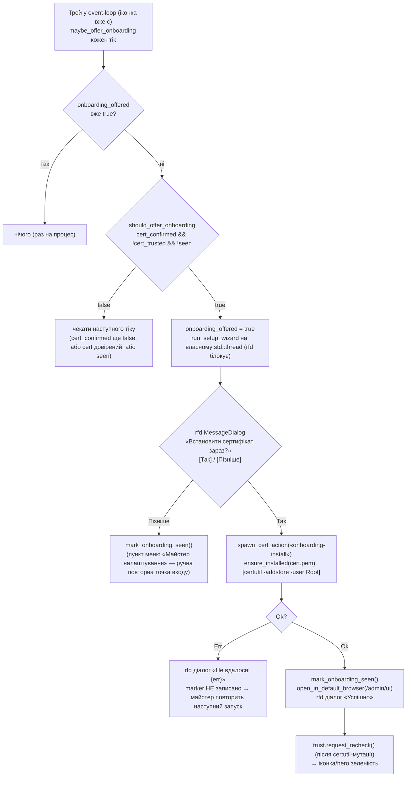

SOURCES: SPEC.md §8 («Онбординг першого запуску», T-188), §2, §7.1 #2; DECISIONS.md 2026-09-08
(T-188 — майстер першого запуску; три-стан `cert-status`), 2026-09-08 (T-191 — «unknown ≠
untrusted» seed); TASKS.md T-188, T-189, T-190; TASKS-DONE.md §«Батч 3.13»; SERVICES.md §dnsqb-tray
«Меню», «Онбординг першого запуску»; UI-SPEC.md §2.1 (hero); `diagrams/ui-status-indicator.md`
(cert-гілка hero); `diagrams/ui-navigation.md` (Dashboard). Код:
`crates/dnsqb-tray/src/{onboarding.rs,main.rs,status.rs}`;
`crates/dnsqb-service/src/{dispatch.rs,admin.rs}`; `crates/dnsqb-service/ui/main.js`.

# Онбординг першого запуску (T-188, Батч 3.13)

Після встановлення MSIX лишаються два ручні кроки, яких нетехнічний користувач не знає:
(1) довірити локальний сертифікат, (2) вказати адресу локального DoH у налаштуваннях браузера.
Майстер веде через крок 1 і відкриває сторінку з інструкцією для кроку 2. **Не** автоматичне
налаштування: `main.rs` fire-and-forget install відхилено (`trust_store.rs` module-doc);
auto-прописування DoH у браузер відхилено (T-99 / T-134 — конфлікт із «без постійних підвищених
прав» і Три Б тихого фолбеку на системний резолвер). Крок 2 на `/admin/ui` (картка «Підключення
браузера») має per-браузерні блоки кроків (Chromium — Chrome/Edge/Brave/Opera; Firefox; інший),
усі в статичному HTML, `main.js` розкриває один за `navigator.userAgent` (+`navigator.brave`,
T-189).

## Тригер майстра — не automaton, три незалежні прапорці (`onboarding::should_offer_onboarding`)

Чиста тотальна `should_offer_onboarding(cert_confirmed, cert_trusted, seen) -> bool` =
`cert_confirmed && !cert_trusted && !seen`. Усі три — незалежні булеві входи, не кроки процесу:

| Прапорець | Джерело | Чому саме так |
|---|---|---|
| `cert_confirmed` | `TrustState::is_confirmed()` — `Arc<AtomicBool>`, виставляється на **першому** `Ok(_)` від `dnsqb_service::is_trusted` у `spawn_trust_watch` | На чистій MSIX-інсталяції служба ще не написала `cert.pem`, коли трей стартує (T-187 — трей перший, заради іконки за ~0.2 с). До першого `Ok` показуваний прапор `cert_trusted` — оптимістичний seed `true`, не читання; майстер не має стартувати на «невідомо» (та сама теза, що «unknown ≠ untrusted» для кольору іконки, T-191). |
| `cert_trusted` | той самий `TrustState`, `is_trusted()` | Майстер лише коли `certutil` **довів** недовіру. |
| `seen` | marker-файл `onboarding.seen` в app-data теці (`onboarding::onboarding_seen`) | Форма `stop.flag`/`quit.flag`, але **не** в `lifecycle`: ті прапори entry-point-процес чистить на старті, а цей мусить пережити кожен запуск. Присутність = сигнал; вміст не читається. Пишеться на [Пізніше] і на **успішний** install — ніколи на невдалий (невдача на машині без довіреного серта повторить пропозицію наступного запуску). |

`maybe_offer_onboarding` кличеться щотік event-loop трея (після `refresh_tray`), з латчем
`onboarding_offered: bool` — раз на процес.

## Потік

## Паралельно — hero `/admin/ui` (той самий стан, інший поверхневий елемент)

`computeProtectionState(status, reachable, certTrust)` (`main.js`) вставляє cert-гілку **після**
0-voters, **перед** «Захищено»:

- `certTrust == "NOT_TRUSTED"` → `is-bad` «Сертифікат не встановлено» + кнопка «Встановити
  сертифікат» → `POST /admin/install-cert` → на успіх `refreshCertStatus()`.
- `certTrust == "UNKNOWN"` → `is-warn` «Сертифікат не перевірено» (окремо — `certutil` не
  відповів).
- `certTrust == null` (ще не fetched) → гілка пропускається.

Джерело — `GET /admin/cert-status` → `CertStatusResponse { trusted: CertTrustView }` (три-стан
`TRUSTED` / `NOT_TRUSTED` / `UNKNOWN`), окремий fetch раз на завантаженні + після install-кліку,
**не** на 2-с status-поллі (кожен виклик = 2 `certutil`-спавни серверно; `serve_admin_cert_status`
з `paths: None` → `Unknown` без спавну). watchdog / network / 0-voters лишаються **вище**
cert-гілки: сервіс досяжний і фільтрація йде — cert лише робить браузерний DoH ненадійним.

## Маршрути

| Маршрут | Метод | DTO | Примітка |
|---|---|---|---|
| `/admin/cert-status` | GET | `CertStatusResponse { trusted: CertTrustView }` | read-only, без CSRF-гейта; `is_trusted(<app-data>/cert.pem)`; `FUZZ_EXCLUDED_ROUTES` |
| `/admin/install-cert` | POST `{}` | `InstallCertResponse { outcome: InstallCertOutcomeView }` | CSRF-гейт + body-cap; `ensure_installed` через `spawn_blocking`; мутує `CurrentUser\Root` (прецедент — `POST /admin/uninstall-local-state`, T-70); `FUZZ_EXCLUDED_ROUTES` |

Трей **не** ходить цими маршрутами — кличе `dnsqb_service::ensure_installed` як lib-функцію
напряму (як `INSTALL_CERT_ID`-хендлер). Маршрути існують для `/admin/ui`.

## ⚠️ GAP — поза обсягом Батча 3.13

- **Автоматичне прописування DoH у браузер** — T-99 / T-134 закрито без коду; майстер лише
  відкриває сторінку з інструкцією, вставлення адреси користувач робить сам.
- **Detection «браузер реально використовує локальний DoH»** (умова 1 `ui-status-indicator.md`) —
  досі блоковано на T-134's canary-механізмі.
- **Кастомне нативне вікно майстра** — `rfd`-діалог прагматичний; трей не має webview. `rfd` не
  підтримує «згортання» (лише закриття) — прийнятне відхилення від первісного запиту.
