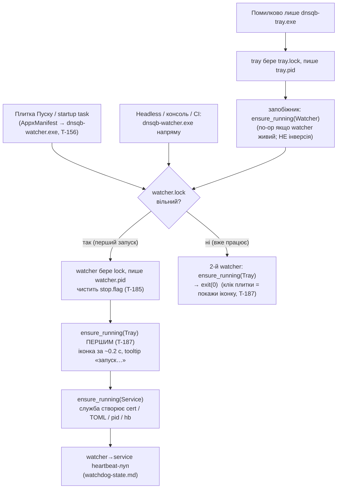

SOURCES: SPEC.md §7 (+ §7.1 — реалізаційні рішення Ф3 Батч 3.0), §1 (лістенер `127.0.0.1`),
§2 (self-signed cert), §6 (лог у памʼяті); `packaging/AppxManifest.template.xml` (T-156 — entry
point + startup task); `plans/silly-wiggling-globe.md` (Батч 3.12 — матриця сценаріїв S1–S15);
DECISIONS.md 2026-09-07 (T-185 — `stop.flag`/`quit.flag`), 2026-09-08 (T-193 — пауза; T-195 — «Повністю видалити»);
TASKS.md T-150, T-181, T-182, T-183, T-185, T-187, T-195; `crates/dnsqb-service/src/watchdog/launcher.rs`
(`ensure_sibling_running`), `crates/dnsqb-service/src/lifecycle.rs` (флаги),
`crates/dnsqb-watcher/src/main.rs` (порядок спавну, повторний запуск, `stop.flag`/`quit.flag`
у лупі), `crates/dnsqb-tray/src/main.rs` (запобіжник, меню T-185), `crates/dnsqb-tray/src/self_uninstall.rs`
(T-195 — wipe теки); `diagrams/watchdog-state.md`
+ `diagrams/watchdog-channels.md` (нагляд після бутстрапу).

# Життя трьох процесів — бутстрап, точки входу, зупинка

Внутрішньо це три процеси («мікросервіси»), для користувача — **монолітний застосунок**:
запускає ОДНЕ (плитку) — піднімається все; «Вийти» — зупиняється все. Ця діаграма — про
**хто кого запускає** й **як усе коректно спинити**; сам нагляд (heartbeat, голосування,
рестарт) — у `watchdog-state.md` / `watchdog-channels.md`.

## Три бінарники

| Бінарник | Subsystem | Роль | Пише в `%LOCALAPPDATA%\dns-quorum-filter\` |
|---|---|---|---|
| `dnsqb-watcher` | GUI (T-181) | **корінь.** Idempotent launcher; `watcher→service` heartbeat; єдиний письменник `watchdog-state.json` | `watcher.{lock,pid,hb}`, `watchdog-state.json` |
| `dnsqb-service` | GUI (T-181) | DoH-лістенер `127.0.0.1:<port>` + quorum + admin-канал + GeoIP; 3 heartbeat-задачі | `service.{lock,pid,hb}`, `cert.pem` + TLS-ключ у OS secret store, дефолтні TOML, `geoip.mmdb`, opt-in `*.enc` |
| `dnsqb-tray` | GUI | іконка + меню; полить `/admin/status` 2 с; клієнт admin-каналу | `tray.{lock,pid}` |

**Чому корінь — watcher, а не трей і не служба** (best practice — Docker/Tailscale/менеджери
служб): супервізор має бути найпростішим процесом. Трей — користувачем-закриваний (не може
бути в ланцюгу життя). Служба — крихка до конфігу (не може спавнити власний супервізор:
циклічний бутстрап). Класична Windows-служба відпадає — вимагає адміна (§7.1, T-99).

## Точки входу й ланцюг бутстрапу



**Loop-free:** `ensure_running(X)` = `plan_launch` (перевірка `X.pid` + identity) → spawn лише
якщо нема живого. Трей, що вже тримає `tray.lock`, не спавниться вдруге; watcher, що тримає
`watcher.lock`, не спавниться вдруге. Жодного tray↔watcher пінг-понгу.

## Зупинка / пауза / відновлення (T-185, переглянуто T-193)

`stop.flag` / `quit.flag` (`%LOCALAPPDATA%\...\`) — **окремі файли**, не `watchdog-state.json`
(§7.1 #7 — єдиний письменник лишається). Правило: **entry-point процес (watcher) чистить прапор
на старті** (пауза не переживає рестарт застосунку — сказано в confirm-діалозі).

**Пауза (T-193):** трей-пункт «Призупинити фільтрацію» пише **лише** `stop.flag` (без
`/admin/shutdown`). `dnsqb-service` **лишається живим** — новий полер `pause_watch::run_pause_watcher`
раз на секунду публікує наявність прапора в `AppState.filtering_paused`, і `handle_query` віддає
кожен A/AAAA-запит через **нефільтрований baseline** (тією ж гілкою, що й «0 провайдерів»: без
кворуму, без GeoIP, без кешу). Власні allow/blocklist користувача далі діють. Watcher наглядає
**як звичайно** — служба здорова, tick — no-op; заморозки heartbeat-лупа більше немає (краш
служби під час паузи тепер респавниться, і нова служба читає `stop.flag` → повертається в
bypass-режимі). Трей показує окремий `TrayStatus::Paused` прямо з наявності прапора; `/admin/ui`
hero — окремий стан «Фільтрацію призупинено» (поле `AdminStatusResponse.paused`).

```mermaid
stateDiagram-v2
    [*] --> Filtering: плитка / логін
    Filtering --> Paused: трей «Призупинити фільтрацію»<br/>(лише stop.flag; служба жива, віддає нефільтрований baseline;<br/>watcher наглядає як звичайно)
    Paused --> Filtering: трей «Відновити фільтрацію»<br/>(clear stop.flag; ensure_sibling_running(Service) — no-op якщо жива)
    Filtering --> Exited: трей «Вийти з DNS Quorum Filter»<br/>(stop.flag + quit.flag; watcher за ≤5 с зупиняє службу й виходить)
    Paused --> Exited: трей «Вийти…»
    Exited --> Filtering: плитка / логін (старт watcher чистить stop.flag)
    Filtering --> Removed: трей «Повністю видалити»<br/>(T-195: секрети + stop/quit.flag; detached powershell чекає вихід усіх 3<br/>і стирає всю %LOCALAPPDATA%\dns-quorum-filter; відкрито ms-settings:appsfeatures)
    Paused --> Removed: трей «Повністю видалити»
    Removed --> [*]: користувач тисне «Видалити» в Параметрах Windows

    Filtering --> Filtering: трей «Сховати іконку»<br/>(виходить лише трей; служба+watcher живі;<br/>повернути — клік плитки → 2-й watcher піднімає трей)
    Filtering --> Filtering: трей «Відновити нагляд»<br/>(завжди в меню; ensure_sibling_running(Watcher),<br/>no-op якщо watcher живий)
```

**S6 (служба крашиться)** — не показано тут: це вже нагляд, `watchdog-state.md` (респавн за
≤~40 с, `ServiceRestarting`/`ServiceGaveUp` у tooltip). **Під час паузи S6 працює так само** —
watcher більше не заморожений.

## Крайові сценарії (з матриці S1–S15, `plans/silly-wiggling-globe.md`)

| Сценарій | Реакція |
|---|---|
| S13 — видалення MSIX | Немає uninstall-хука. Трей «Повністю видалити» (T-70 + **T-195**): чистить cert + секрети Credential Manager, тоді пише `stop.flag`+`quit.flag`, спавнить від'єднаний прихований `powershell` (`self_uninstall.rs`), що чекає на вихід усіх 3 процесів і стирає всю `%LOCALAPPDATA%\dns-quorum-filter`, і відкриває `ms-settings:appsfeatures` (`explorer.exe`); фінальний клік «Видалити» — у Параметрах Windows. `/admin/uninstall-local-state` — лише секрети (крутиться в службі). |
| S14 — Linux / headless | Guard `instance::acquire` — `#[cfg(windows)]` → `UnsupportedPlatform` → service/watcher виходять одразу; трей без дисплея не стартує. **Нічого не працює — Фаза 6.** Лог (T-184) робить це зрозумілим |
| S15 — dev (`cargo run`, debug) | `windows_subsystem` під `not(debug_assertions)` → debug лишає консоль зі stdout. Ручний старт будь-якого бінарника |

## Рішення, яких SPEC §7 прямо не називає (інтерпретація, позначено чесно)

- **Порядок спавну tray-first** — §7 каже лише «launcher піднімає siblings»; порядок обрано в
  T-187 заради швидкої появи іконки. Не впливає на коректність (guard'и ідемпотентні).
- **2-й watcher-інстанс піднімає трей і виходить `exit(0)`** — раніше був `exit(1)`. §7.1 #2
  каже «не стартувати другий watcher», не каже, що робити ще; T-187 дає йому єдину корисну дію
  (показати іконку) — стандартний single-instance-патерн «повторний запуск → показати вікно».
- **`stop.flag` як механізм навмисної зупинки** — новий cross-process сигнал, DECISIONS.md
  (T-185, переглянуто T-193 2026-09-08). §7 описував лише авто-нагляд, не навмисний вихід
  користувача. **T-193:** пауза більше не вбиває службу — служба сама читає `stop.flag`
  (`pause_watch`) і віддає нефільтрований baseline; watcher більше не заморожується (заморозка
  Батча 3.12 закривала `RestartBudget`-вигорання, спричинене саме тим, що стара пауза слала
  `/admin/shutdown` — щойно служба лишається жива, tick — no-op, проблема зникає). Трей досі
  дістає окремий `TrayStatus::Paused`; пауза не переживає рестарт застосунку.
- **Трей-запобіжник `ensure_running(Watcher)`** — трей формально launcher-scope (§7), не
  супервізор; запобіжник — лише для ручного запуску не того `.exe`, не постійний нагляд.

## Крос-посилання

`watchdog-state.md` / `watchdog-channels.md` — що відбувається ПІСЛЯ бутстрапу (нагляд,
голосування, рестарт). `ui-status-indicator.md` — як стани watchdog показуються в UI.
