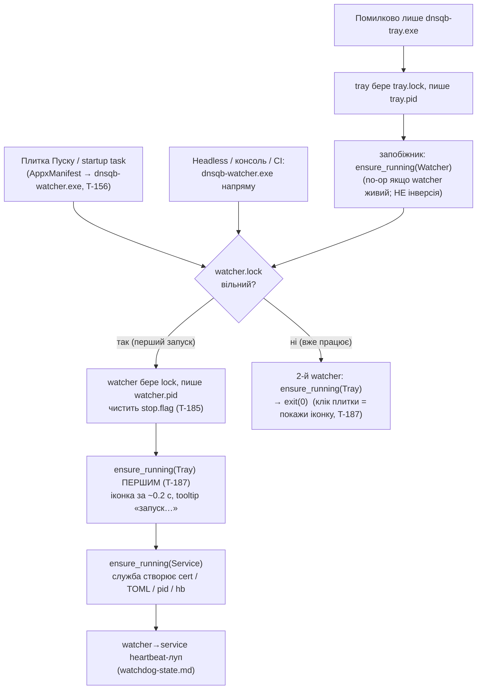

SOURCES: SPEC.md §7 (+ §7.1 — реалізаційні рішення Ф3 Батч 3.0), §1 (лістенер `127.0.0.1`),
§2 (self-signed cert), §6 (лог у памʼяті); `packaging/AppxManifest.template.xml` (T-156 — entry
point + startup task); `plans/silly-wiggling-globe.md` (Батч 3.12 — матриця сценаріїв S1–S15);
TASKS.md T-150, T-181, T-182, T-183, T-185, T-187; `crates/dnsqb-service/src/watchdog/launcher.rs`
(`ensure_sibling_running`), `crates/dnsqb-watcher/src/main.rs` (порядок спавну + повторний
запуск), `crates/dnsqb-tray/src/main.rs` (запобіжник); `diagrams/watchdog-state.md` +
`diagrams/watchdog-channels.md` (нагляд після бутстрапу).

# Життя трьох процесів — бутстрап, точки входу, зупинка

Внутрішньо це три процеси («мікросервіси»), для користувача — **монолітний застосунок**:
запускає ОДНЕ (плитку) — піднімається все; «Вийти» — зупиняється все. Ця діаграма — про
**хто кого запускає** й **як усе коректно спинити**; сам нагляд (heartbeat, голосування,
рестарт) — у `watchdog-state.md` / `watchdog-channels.md`.

## Три бінарники

| Бінарник | Subsystem | Роль | Пише в `%LOCALAPPDATA%\dns-quorum-filter\` |
|---|---|---|---|
| `dnsqb-watcher` | GUI (T-181) | **корінь.** Idempotent launcher; `watcher→service` heartbeat; єдиний письменник `watchdog-state.json` | `watcher.{lock,pid,hb}`, `watchdog-state.json` |
| `dnsqb-service` | GUI (T-181) | DoH-лістенер `127.0.0.1:<port>` + quorum + admin-канал + GeoIP; 3 heartbeat-задачі | `service.{lock,pid,hb}`, `cert.pem` + TLS-ключ у OS secret store, дефолтні TOML, `geoip.mmdb`, opt-in `*.enc` |
| `dnsqb-tray` | GUI | іконка + меню; полить `/admin/status` 2 с; клієнт admin-каналу | `tray.{lock,pid}` |

**Чому корінь — watcher, а не трей і не служба** (best practice — Docker/Tailscale/менеджери
служб): супервізор має бути найпростішим процесом. Трей — користувачем-закриваний (не може
бути в ланцюгу життя). Служба — крихка до конфігу (не може спавнити власний супервізор:
циклічний бутстрап). Класична Windows-служба відпадає — вимагає адміна (§7.1, T-99).

## Точки входу й ланцюг бутстрапу



**Loop-free:** `ensure_running(X)` = `plan_launch` (перевірка `X.pid` + identity) → spawn лише
якщо нема живого. Трей, що вже тримає `tray.lock`, не спавниться вдруге; watcher, що тримає
`watcher.lock`, не спавниться вдруге. Жодного tray↔watcher пінг-понгу.

## Зупинка / пауза / відновлення

> ⚠️ **Заплановано — T-185, ще НЕ в коді.** `stop.flag` і пункти меню нижче — цільова модель
> цього батчу; станом на T-187 меню трея ще: «Перезапустити» (=`/admin/reset`), «Зупинити
> фільтрацію» (=`/admin/shutdown`, службу watchdog респавнить за ~40 с), «Закрити» (лише трей).

`stop.flag` (`%LOCALAPPDATA%\...\stop.flag`) — **окремий файл**, не `watchdog-state.json`
(§7.1 #7 — єдиний письменник лишається). Правило: **entry-point процес (watcher) чистить прапор
на старті; watcher у heartbeat-лупі прапор лише ПОВАЖАЄ** (бачить → не респавнить службу),
ніколи не чистить там — інакше headless-запуск не зміг би відновитись.

```mermaid
stateDiagram-v2
    [*] --> Running: плитка / логін
    Running --> Paused: трей «Призупинити фільтрацію»<br/>(/admin/shutdown пише stop.flag)
    Paused --> Running: трей «Відновити фільтрацію»<br/>(spawn_sibling(Service), старт чистить stop.flag)
    Running --> Exited: трей «Вийти з DNS Quorum Filter»<br/>(stop.flag + сигнал watcher'у на вихід)
    Paused --> Exited: трей «Вийти…»
    Exited --> Running: плитка / логін (старт watcher чистить stop.flag)

    Running --> Running: трей «Сховати лише іконку»<br/>(виходить лише трей; служба+watcher живі;<br/>повернути — клік плитки → 2-й watcher піднімає трей)
    Running --> Running: watcher помер → трей показує<br/>«Відновити нагляд» → spawn_sibling(Watcher)
```

**S6 (служба крашиться)** — не показано тут: це вже нагляд, `watchdog-state.md` (респавн за
≤~40 с, `ServiceRestarting`/`ServiceGaveUp` у tooltip).

## Крайові сценарії (з матриці S1–S15, `plans/silly-wiggling-globe.md`)

| Сценарій | Реакція |
|---|---|
| S13 — видалення MSIX | Немає uninstall-хука → cert у `LocalMachine\TrustedPeople` + секрети в Credential Manager + `%LOCALAPPDATA%` лишаються. Прибрати **до** видалення: трей «Повністю видалити» (T-70) |
| S14 — Linux / headless | Guard `instance::acquire` — `#[cfg(windows)]` → `UnsupportedPlatform` → service/watcher виходять одразу; трей без дисплея не стартує. **Нічого не працює — Фаза 6.** Лог (T-184) робить це зрозумілим |
| S15 — dev (`cargo run`, debug) | `windows_subsystem` під `not(debug_assertions)` → debug лишає консоль зі stdout. Ручний старт будь-якого бінарника |

## Рішення, яких SPEC §7 прямо не називає (інтерпретація, позначено чесно)

- **Порядок спавну tray-first** — §7 каже лише «launcher піднімає siblings»; порядок обрано в
  T-187 заради швидкої появи іконки. Не впливає на коректність (guard'и ідемпотентні).
- **2-й watcher-інстанс піднімає трей і виходить `exit(0)`** — раніше був `exit(1)`. §7.1 #2
  каже «не стартувати другий watcher», не каже, що робити ще; T-187 дає йому єдину корисну дію
  (показати іконку) — стандартний single-instance-патерн «повторний запуск → показати вікно».
- **`stop.flag` як механізм навмисної зупинки** — новий cross-process сигнал, DECISIONS.md
  (T-185). §7 описував лише авто-нагляд, не навмисний вихід користувача.
- **Трей-запобіжник `ensure_running(Watcher)`** — трей формально launcher-scope (§7), не
  супервізор; запобіжник — лише для ручного запуску не того `.exe`, не постійний нагляд.

## Крос-посилання

`watchdog-state.md` / `watchdog-channels.md` — що відбувається ПІСЛЯ бутстрапу (нагляд,
голосування, рестарт). `ui-status-indicator.md` — як стани watchdog показуються в UI.
