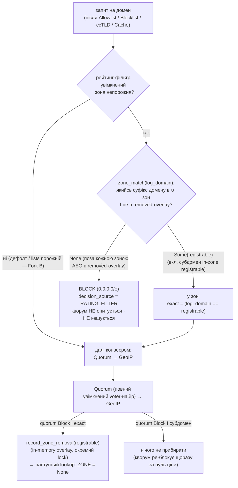

SOURCES: SPEC.md §5.3 (рейтинговий фільтр — ядро Фази 4), §5.1.1 (персональне джерело зон),
§5 і §5.3 конвеєр-порядок, §5.2 (ccTLD — сусідній крок), §6 (`decision_source`), "Відкриті
питання" п.8 (default-OFF — не судження); DECISIONS.md 2026-09-07 (T-179 — §5.1 прибрано),
2026-09-09 ×2 (T-108 лінива гігієна; T-108/T-124 overlay in-memory / окремий lock / exact-match);
TASKS.md §"Фаза 4" "План виконання Ф4"; T-104/T-106 (kickoff-гейти); `diagrams/ui-status-indicator.md`
(індикатор — T-128). **Код (T-124, Батч 4.3 — крок 5 збудовано):** `rating_filter.rs`
(`ZoneLists::zone_match` — suffix-walk, `rating_filter.rs`), `pipeline.rs::handle_query`
(`rating_filter_step` після кешу, перед `resolve`; `rating_filter_block_with_meta`;
`quorum_block_response_with_meta` → `QueryLogMeta::zone_removal`), `dispatch.rs::resolve_doh_request`
(`record_zone_removal`), `topn_updater.rs` (`run_topn_updater`), `config.rs` (`[rating_filter]`).

# Рейтинговий фільтр «бульбашка» — позиція в конвеєрі + джерела зон

**Одна opt-in фіча, дефолт ВИМКНЕНО (обов'язково, не судження — п.8).** Механізм: домен **поза**
зведеними зонами доступності → `BLOCK`, кворум не опитується; домен **у зоні** → звичайний конвеєр
далі (Quorum → GeoIP), **без жодного звуження voter-набору**. «Потрапляння в зону» саме по собі
нічого не дає, крім «пропустити далі». Це **не** безпекова фіча — свідоме звуження доступного
простору (батьківський контроль / digital minimalism), не захист від загроз.

§5.1 (окреме always-on звуження voter-набору для топ-сайтів) **прибрано** — це єдиний механізм
топ-сайтів у проєкті. Перенесено з Фази 5 у Фазу 4 (T-179).

## Позиція в конвеєрі (авторитетний порядок — SPEC §5.3)

| # | Крок | Дія | Мережа? |
|---|------|-----|---------|
| 1 | Allowlist | збіг → `ALLOW`, нічого нижче не опитується | ні |
| 2 | Blocklist | збіг → `BLOCK` | ні |
| 3 | ccTLD-блок (§5.2) | суфікс домену в списку → `BLOCK` | ні |
| 4 | Cache | валідний запис → взяти quorum-вердикт з нього | ні |
| **5** | **Рейтинговий фільтр (§5.3)** | **лише якщо увімкнений: домен НЕ в жодній зоні → `BLOCK`, `decision_source = RATING_FILTER`, кворум не опитується. У зоні / фільтр вимкнений → не втручається** | **ні** |
| 6 | Quorum | опитати увімкнені апстріми, OR-логіка | так |
| 7 | GeoIP (§3.5) | живцем на `ALLOW`-відповідь (кешовану чи свіжу), не кешується | ні (локальний mmap) |

Останній локальний крок перед кворумом — остання нагода вирішити щось без мережі. Усі вищі
механізми (allowlist, blocklist, ccTLD, кеш) переважають цей фільтр. **GeoIP лишається після
кворуму** — фільтрує за країною *резолвленої IP*, якої до кворуму не існує (data dependency).

## Чотири джерела «дозволених зон» (∪, різні моделі курації)

| Джерело | Курація | Дефолт | Задача |
|---------|---------|--------|--------|
| Курований топ-N по країні + `global` | Проєктний інструмент `curate_topn` (**без DNS**): fetch CrUX (CC BY 4.0; **не** Cloudflare Radar — CC BY-NC, T-106) → origin→registrable (пінований PSL) → `data/topn/<list>.txt` + `.sha256`, стабільний URL. Клієнт (`topn_updater`) завантажує тим самим механізмом, що GeoIP. **Гігієна (T-108) — лінива рантайм, не при курації:** опублікований список сирий; клієнт прибирає домен, коли кворум блокує **сам registrable**, з in-memory overlay (DECISIONS.md 2026-09-09) | активний для обраних `lists` | T-107, T-108, T-124 |
| Державні домени (`*.gov`, `*.gov.ua`, `*.gob.*` …) | Евристичне кандидування + **обов'язкове ручне рев'ю**. Дефолт N=10/країну | увімкнено | T-122 |
| Науково-освітні / некомерційні (PubMed, NASA …) | **Ручна**, версіонована, з changelog. Не per-country, не алгоритмічна. Редакційне судження — тримати публічним і простежуваним | увімкнено | T-123 |
| Персональний локально навчений список (§5.1.1) | Локальне навчання: частота ∩ регулярність відвідувань; джерело сигналу — **лише вже-`ALLOW`-вердикти кворуму**. Окреме шифроване локальне сховище. Тільки **додає** домени | **ВИМКНЕНО** (окремий opt-in, вища приватнісна планка) | T-138 |

**Ручний allowlist користувача (крок 1)** — запобіжник поверх усього: навіть з увімкненим
фільтром користувач може вручну відкрити конкретний домен поза зонами.

## Потік рішення

Джерела зони — `∪`: курований топ-N країни + `global` ∪ [держ / науково-освітні — Батч 4.2] ∪
[персональний §5.1.1 — Батч 4.5] ∪ ручний allowlist (крок 1, вище). `ZoneSourceKind` — відкритий
enum, тож 4.2/4.5 адитивні.

## Рішення, яких SPEC §5.3 прямо не називає (розвʼязано при T-124)

- **Збіг «домен у зоні» — суфіксний, не лише точний registrable** (`ZoneLists::zone_match`,
  `rating_filter.rs`). Прогулянка по суфіксах хоста проти самого набору зони: збіг на будь-якому
  суфіксі → в зоні, тож субдомен in-zone registrable теж у зоні. PSL клієнту не потрібен — набір
  містить рівно registrable після `curate_topn`, а голі публічні суфікси `curate_topn` пропускає.
- **Лінива гігієна прибирає лише точний registrable** (`log_domain == matched_registrable`).
  Блок субдомену (`sub.example.co.uk`) → нічого не прибирати: кворум і так блокує його щоразу, а
  виселення `example.co.uk` — хибне over-blocking (DECISIONS.md 2026-09-09).
- **Overlay прибраного — in-memory, окремий lock** від зони (`AppState.rating_filter_removed` vs
  `rating_filter_zone`, взірець `geoip`/`geoip_countries`). Не персистується цей батч — переживає
  тумблер, відновлюється ліниво після рестарту; персистенція — Батч 4.5.
- **`enabled` без завантажених списків → фільтр інертний** (Fork B), не block-everything —
  `dispatch::resolve_doh_request` дає `None` замість `RatingFilterView`, лог-warn при старті.
- **Порядок перевірки джерел зон** — не важливий для результату (∪). `decision_source =
  RATING_FILTER` лише каже «цей крок заблокував»; окремого поля «яке джерело впустило» немає.
- **Дефолт держ / науково-освітніх «увімкнено»** — ефект лише коли сам фільтр увімкнений; per-source
  тумблери додає Батч 4.4 (T-111).

## Крос-посилання на UI

`diagrams/ui-status-indicator.md` — індикатор активності рейтинг-фільтра **обов'язковий, завжди
видимий** (T-128), не лише в налаштуваннях; окремий візуально виділений enable-тумблер із явним
попередженням «буде недоступна переважна більшість інтернету» (T-127), НЕ звичайний чекбокс поруч
з категорійними. Картка конфігурації зон (N, країни, персональний список) — T-111, імовірно в
`
` «Розширені» (T-176 поділ).
