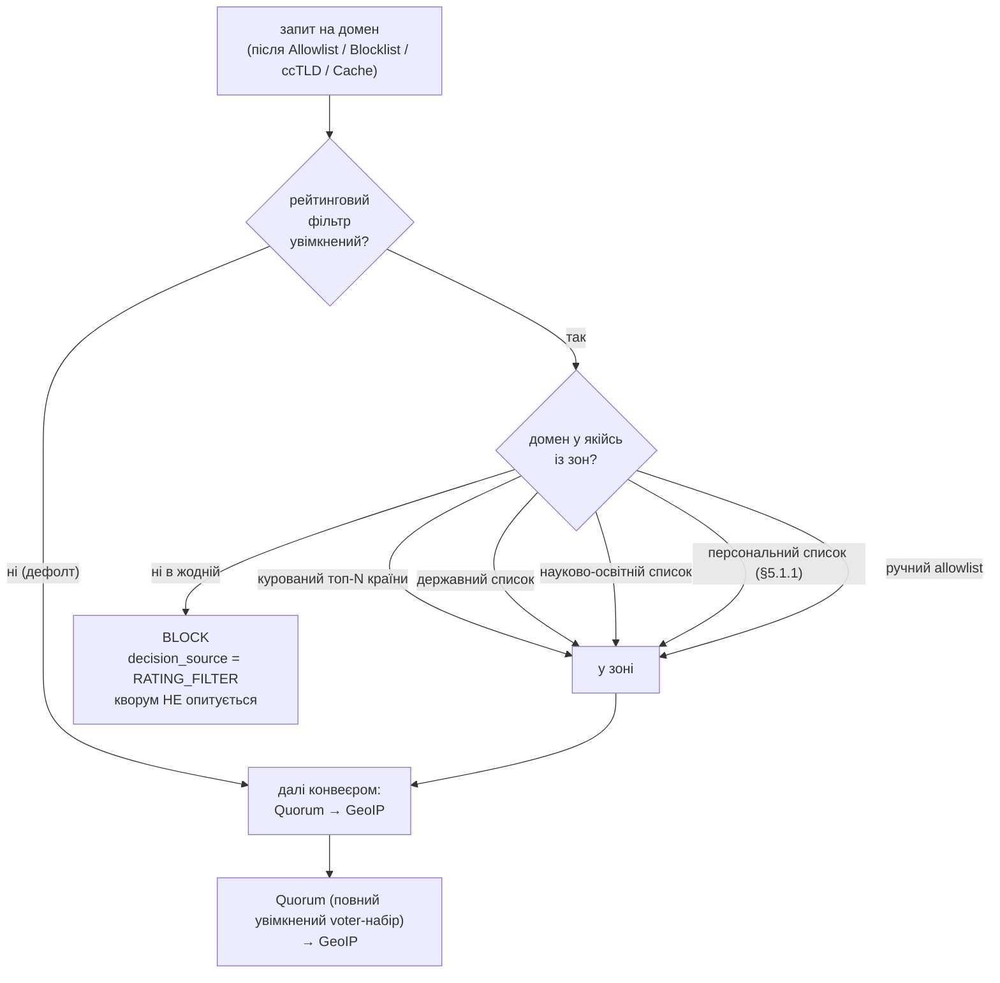

SOURCES: SPEC.md §5.3 (рейтинговий фільтр — ядро Фази 4), §5.1.1 (персональне джерело зон),
§5 і §5.3 конвеєр-порядок, §5.2 (ccTLD — сусідній крок), §6 (`decision_source`), "Відкриті
питання" п.8 (default-OFF — не судження); DECISIONS.md 2026-09-07 (T-179 — §5.1 прибрано,
рейтинг-фільтр перенесено Ф5→Ф4); TASKS.md §"Фаза 4" блок "План виконання Ф4" (T-107, T-108,
T-111, T-120, T-122–T-131, T-138); T-104/T-106 (kickoff-гейти); `diagrams/ui-status-indicator.md`
(індикатор активності — T-128). Коду ще немає — синхронізація проти тексту §5.3, не проти
реалізації.

# Рейтинговий фільтр «бульбашка» — позиція в конвеєрі + джерела зон

**Одна opt-in фіча, дефолт ВИМКНЕНО (обов'язково, не судження — п.8).** Механізм: домен **поза**
зведеними зонами доступності → `BLOCK`, кворум не опитується; домен **у зоні** → звичайний конвеєр
далі (Quorum → GeoIP), **без жодного звуження voter-набору**. «Потрапляння в зону» саме по собі
нічого не дає, крім «пропустити далі». Це **не** безпекова фіча — свідоме звуження доступного
простору (батьківський контроль / digital minimalism), не захист від загроз.

§5.1 (окреме always-on звуження voter-набору для топ-сайтів) **прибрано** — це єдиний механізм
топ-сайтів у проєкті. Перенесено з Фази 5 у Фазу 4 (T-179).

## Позиція в конвеєрі (авторитетний порядок — SPEC §5.3)

| # | Крок | Дія | Мережа? |
|---|------|-----|---------|
| 1 | Allowlist | збіг → `ALLOW`, нічого нижче не опитується | ні |
| 2 | Blocklist | збіг → `BLOCK` | ні |
| 3 | ccTLD-блок (§5.2) | суфікс домену в списку → `BLOCK` | ні |
| 4 | Cache | валідний запис → взяти quorum-вердикт з нього | ні |
| **5** | **Рейтинговий фільтр (§5.3)** | **лише якщо увімкнений: домен НЕ в жодній зоні → `BLOCK`, `decision_source = RATING_FILTER`, кворум не опитується. У зоні / фільтр вимкнений → не втручається** | **ні** |
| 6 | Quorum | опитати увімкнені апстріми, OR-логіка | так |
| 7 | GeoIP (§3.5) | живцем на `ALLOW`-відповідь (кешовану чи свіжу), не кешується | ні (локальний mmap) |

Останній локальний крок перед кворумом — остання нагода вирішити щось без мережі. Усі вищі
механізми (allowlist, blocklist, ccTLD, кеш) переважають цей фільтр. **GeoIP лишається після
кворуму** — фільтрує за країною *резолвленої IP*, якої до кворуму не існує (data dependency).

## Чотири джерела «дозволених зон» (∪, різні моделі курації)

| Джерело | Курація | Дефолт | Задача |
|---------|---------|--------|--------|
| Курований топ-N по країні | Проєктний CI-конвеєр: fetch чисто-ліцензованого per-country рейтингу (CrUX CC BY 4.0 — провідний кандидат; **не** Cloudflare Radar — CC BY-NC, T-106) → нормалізація origin→registrable → версійований файл + `.sha256`. Клієнт завантажує тим самим механізмом, що GeoIP. Гігієна: не включати домен із Security-блоклиста; **відфільтрувати adult/gambling** (T-104 показав, що топ-N його містить) | активний для обраних країн | T-107, T-108 |
| Державні домени (`*.gov`, `*.gov.ua`, `*.gob.*` …) | Евристичне кандидування + **обов'язкове ручне рев'ю**. Дефолт N=10/країну | увімкнено | T-122 |
| Науково-освітні / некомерційні (PubMed, NASA …) | **Ручна**, версіонована, з changelog. Не per-country, не алгоритмічна. Редакційне судження — тримати публічним і простежуваним | увімкнено | T-123 |
| Персональний локально навчений список (§5.1.1) | Локальне навчання: частота ∩ регулярність відвідувань; джерело сигналу — **лише вже-`ALLOW`-вердикти кворуму**. Окреме шифроване локальне сховище. Тільки **додає** домени | **ВИМКНЕНО** (окремий opt-in, вища приватнісна планка) | T-138 |

**Ручний allowlist користувача (крок 1)** — запобіжник поверх усього: навіть з увімкненим
фільтром користувач може вручну відкрити конкретний домен поза зонами.

## Потік рішення

## Рішення, яких SPEC §5.3 прямо не називає (інтерпретація, позначено чесно)

- **Збіг «домен у зоні»** — точний registrable-домен чи суфіксний? §5.1 (прибрана) казала «лише
  точний домен, без wildcard»; для рейтинг-фільтра §5.3 текст явно не фіксує. Рішення — при T-124
  (імовірно точний registrable-домен, узгоджено з нормалізацією курації origin→registrable).
- **Порядок перевірки джерел зон** — не важливий для результату (∪), лише для `decision`-трасування
  в логу (яке саме джерело «впустило»). Чи логувати конкретне джерело — рішення при T-112-наступнику
  (окремого поля наразі не заплановано; `decision_source = RATING_FILTER` лише каже «не заблокував
  цей крок»).
- **Дефолт державного / науково-освітнього списків «увімкнено»** — коли сам фільтр вимкнений,
  це не має ефекту; питання постає лише при увімкненні фільтра. Текст §5.3 каже «зони», не
  розписуючи per-source тумблери — T-111 їх додає.

## Крос-посилання на UI

`diagrams/ui-status-indicator.md` — індикатор активності рейтинг-фільтра **обов'язковий, завжди
видимий** (T-128), не лише в налаштуваннях; окремий візуально виділений enable-тумблер із явним
попередженням «буде недоступна переважна більшість інтернету» (T-127), НЕ звичайний чекбокс поруч
з категорійними. Картка конфігурації зон (N, країни, персональний список) — T-111, імовірно в
`
` «Розширені» (T-176 поділ).
