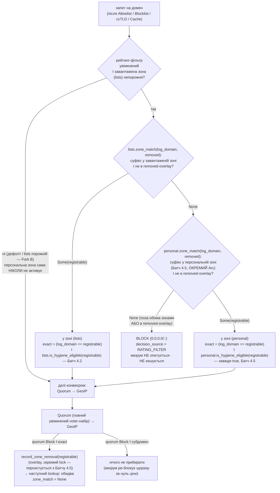

SOURCES: SPEC.md §5.3 (рейтинговий фільтр — ядро Фази 4), §5.1.1 (персональне джерело зон),
§5 і §5.3 конвеєр-порядок, §5.2 (ccTLD — сусідній крок), §6 (`decision_source`), "Відкриті
питання" п.8 (default-OFF — не судження); DECISIONS.md 2026-09-07 (T-179 — §5.1 прибрано),
2026-09-09 ×2 (T-108 лінива гігієна; T-108/T-124 overlay in-memory / окремий lock / exact-match);
TASKS.md §"Фаза 4" "План виконання Ф4"; T-104/T-106 (kickoff-гейти); `diagrams/ui-status-indicator.md`
(індикатор — T-128); DECISIONS.md 2026-09-10 (T-127 — `validate_rating_filter_lists` звужено до
членства в `AVAILABLE_TOPN_LISTS`). **Код (T-124, Батч 4.3 — крок 5 збудовано):** `rating_filter.rs`
(`ZoneLists::zone_match` — suffix-walk, `rating_filter.rs`), `pipeline.rs::handle_query`
(`rating_filter_step` після кешу, перед `resolve`; `rating_filter_block_with_meta`;
`quorum_block_response_with_meta` → `QueryLogMeta::zone_removal`), `dispatch.rs::resolve_doh_request`
(`record_zone_removal`), `topn_updater.rs` (`run_topn_updater`), `config.rs` (`[rating_filter]`).
**UI/маршрут (T-111/T-127/T-128, Батч 4.4):** `dispatch.rs` (`POST /admin/rating-filter`,
`apply_rating_filter_change`, `rating_filter_is_active` — єдиний авторитет для гейта конвеєра
й бейджа), `admin.rs` (`RatingFilterStatusView`/`ZoneListStatusView`/`RatingFilterConfigUpdate`,
`AdminClient::set_rating_filter`), `ui/{index.html,main.js,style.css}` (картка `#rating-filter-body`
+ бейдж `#rating-filter-badge`), `dnsqb-tray/status.rs` (`TrayStatus::Filtering.rating_filter_active`
→ суфікс тултипа), `config.rs` (`+UnknownRatingFilterList`). **T-122/T-123 (Батч 4.2, зроблено):**
`rating_filter.rs` (`ZoneSourceKind::GovernmentTopN`/`SciEdu`, `hygiene_eligible`,
`ZoneLists::is_hygiene_eligible`), `pipeline.rs::rating_filter_step` (`exact` += eligibility-гейт),
`topn_download.rs` (`AVAILABLE_TOPN_LISTS` += `gov-*`/`edu`), `topn_updater.rs`
(`zone_source_kind` routing), `config.rs` (`validate_rating_filter_lists` розширено),
`data/topn/{README.md,ZONES-CHANGELOG.md,gov-*.txt,edu.txt}`. **T-138 (Батч 4.5, зроблено):**
DECISIONS.md 2026-09-11 (навігація-vs-subresource прийнято як прогалину; архітектура окремого
`Arc<ZoneLists>`; advisor-знахідка активації; T-217 знайдений-не-виправлений staleness-баг).
`rating_filter.rs` (`ZoneSourceKind::Personal`), нові `personal_zone_stats.rs`/
`personal_zone_persist.rs`/`zone_removal_persist.rs`, `pipeline.rs::rating_filter_step`
(другий незалежний `zone_match`-виклик на `personal`), `dispatch.rs` (`AppState.
rating_filter_personal_zone`, `record_personal_visit`, `rotate_and_republish_personal_zone`,
`restore_rating_filter_removed`), `config.rs` (`[personal_zone]` + `validate_personal_zone`),
`key_store.rs` (4-й секрет `personal-zone-key`), `admin.rs`
(`RatingFilterStatusView.personal_zone_enabled`, `loaded` включає `"personal"`), `local_state.rs`
(5-й артефакт).

# Рейтинговий фільтр «бульбашка» — позиція в конвеєрі + джерела зон

**Одна opt-in фіча, дефолт ВИМКНЕНО (обов'язково, не судження — п.8).** Механізм: домен **поза**
зведеними зонами доступності → `BLOCK`, кворум не опитується; домен **у зоні** → звичайний конвеєр
далі (Quorum → GeoIP), **без жодного звуження voter-набору**. «Потрапляння в зону» саме по собі
нічого не дає, крім «пропустити далі». Це **не** безпекова фіча — свідоме звуження доступного
простору (батьківський контроль / digital minimalism), не захист від загроз.

§5.1 (окреме always-on звуження voter-набору для топ-сайтів) **прибрано** — це єдиний механізм
топ-сайтів у проєкті. Перенесено з Фази 5 у Фазу 4 (T-179).

## Позиція в конвеєрі (авторитетний порядок — SPEC §5.3)

| # | Крок | Дія | Мережа? |
|---|------|-----|---------|
| 1 | Allowlist | збіг → `ALLOW`, нічого нижче не опитується | ні |
| 2 | Blocklist | збіг → `BLOCK` | ні |
| 3 | ccTLD-блок (§5.2) | суфікс домену в списку → `BLOCK` | ні |
| 4 | Cache | валідний запис → взяти quorum-вердикт з нього | ні |
| **5** | **Рейтинговий фільтр (§5.3)** | **лише якщо увімкнений: домен НЕ в жодній зоні → `BLOCK`, `decision_source = RATING_FILTER`, кворум не опитується. У зоні / фільтр вимкнений → не втручається** | **ні** |
| 6 | Quorum | опитати увімкнені апстріми, OR-логіка | так |
| 7 | GeoIP (§3.5) | живцем на `ALLOW`-відповідь (кешовану чи свіжу), не кешується | ні (локальний mmap) |

Останній локальний крок перед кворумом — остання нагода вирішити щось без мережі. Усі вищі
механізми (allowlist, blocklist, ccTLD, кеш) переважають цей фільтр. **GeoIP лишається після
кворуму** — фільтрує за країною *резолвленої IP*, якої до кворуму не існує (data dependency).

## Чотири джерела «дозволених зон» (∪, різні моделі курації)

| Джерело | Курація | Дефолт | Задача |
|---------|---------|--------|--------|
| Курований топ-N по країні + `global` | Проєктний інструмент `curate_topn` (**без DNS**): fetch CrUX (CC BY 4.0; **не** Cloudflare Radar — CC BY-NC, T-106) → origin→registrable (пінований PSL) → `data/topn/<list>.txt` + `.sha256`, стабільний URL. Клієнт (`topn_updater`) завантажує тим самим механізмом, що GeoIP. **Гігієна (T-108) — лінива рантайм, не при курації:** опублікований список сирий; клієнт прибирає домен, коли кворум блокує **сам registrable**, з in-memory overlay (DECISIONS.md 2026-09-09) | активний для обраних `lists` | T-107, T-108, T-124 |
| Державні домени (blanket-suffix: `gov.ua`, `gov`, `gov.pl`, `gov.uk`) | Вручну зібраний, критерій — обмежена реєстратором політика реєстрації (не евристичне кандидування — спрощено на kickoff'і, DECISIONS.md 2026-09-11 у Батчі 4.2) | активний, якщо обрано | T-122 |
| Науково-освітні / некомерційні (PubMed, NASA …) | **Ручна**, версіонована, з changelog. Не per-country, не алгоритмічна. Редакційне судження — тримати публічним і простежуваним | активний, якщо обрано | T-123 |
| Персональний локально навчений список (§5.1.1) | Локальне навчання: частота ∪ регулярність відвідувань (об'єднання, не перетин); джерело сигналу — **лише вже-ALLOW-і-вже-пройшов-Quorum трафік**. Окреме, 4-те шифроване сховище (свій ключ). Тільки **додає** домени; ніколи сам не активує бульбашку (лише розширює вже активну) | **ВИМКНЕНО** (окремий opt-in, вища приватнісна планка) — T-138, зроблено 2026-09-11 | T-138 |

**Ручний allowlist користувача (крок 1)** — запобіжник поверх усього: навіть з увімкненим
фільтром користувач може вручну відкрити конкретний домен поза зонами.

## Потік рішення

**Два незалежні `zone_match`-виклики, не один `∪`-набір** (Батч 4.5): курований топ-N + `global` ∪
держ (`GovernmentTopN`) / науково-освітні (`SciEdu`) живуть в одному `AppState.rating_filter_zone:
Arc<ZoneLists>` (писач — `topn_updater`, 24-годинний цикл, повна заміна); персональний список
(§5.1.1) живе в **окремому** `AppState.rating_filter_personal_zone: Arc<ZoneLists>` (писач —
`personal_zone_persist`, щоденний rollover) — два незалежні писачі до одного `Arc` конфліктували б,
тож `pipeline::rating_filter_step` перевіряє їх послідовно, кожен своїм `zone_match`-викликом, а не
зливає в один набір. Ручний allowlist (крок 1, вище) лишається окремим запобіжником поза цим
кроком. `ZoneSourceKind` — закритий enum (усі 4 варіанти вже реалізовано), нові варіанти в
принципі адитивні для pipeline/UI/DTO — **але не для T-108 лінивої гігієни**
(`ZoneSourceKind::hygiene_eligible`, нижче) і **не для активації бульбашки**
(`rating_filter_is_active` бере до уваги лише завантажену `lists`-зону, ніколи персональну —
advisor-знахідка Батчу 4.5, DECISIONS.md 2026-09-11).

## Рішення, яких SPEC §5.3 прямо не називає (розвʼязано при T-124)

- **Збіг «домен у зоні» — суфіксний, не лише точний registrable** (`ZoneLists::zone_match`,
  `rating_filter.rs`). Прогулянка по суфіксах хоста проти самого набору зони: збіг на будь-якому
  суфіксі → в зоні, тож субдомен in-zone registrable теж у зоні. PSL клієнту не потрібен — набір
  містить рівно registrable після `curate_topn`, а голі публічні суфікси `curate_topn` пропускає.
- **Лінива гігієна прибирає лише точний registrable** (`log_domain == matched_registrable`).
  Блок субдомену (`sub.example.co.uk`) → нічого не прибирати: кворум і так блокує його щоразу, а
  виселення `example.co.uk` — хибне over-blocking (DECISIONS.md 2026-09-09).
- **Overlay прибраного — окремий lock** від зони (`AppState.rating_filter_removed` vs
  `rating_filter_zone`, взірець `geoip`/`geoip_countries`). **Персистується з Батчу 4.5**
  (`zone_removal_persist.rs`, `zone-removals.enc`, спільний `persistence-key` T-96/97, гейт —
  `[rating_filter].enabled`) — переживає й тумблер, і рестарт процесу.
- **`enabled` без завантажених списків → фільтр інертний** (Fork B), не block-everything —
  `dispatch::resolve_doh_request` дає `None` замість `RatingFilterView`, лог-warn при старті.
- **Порядок перевірки джерел зон** — не впливає на **членство** (все ще ефективно `∪` для «в
  зоні чи ні»), `decision_source = RATING_FILTER` лише каже «цей крок заблокував», окремого поля
  «яке джерело впустило» немає. **Але з Батчу 4.5 впливає на `hygiene_eligible`,** коли той самий
  домен присутній і в `lists`, і в персональній зоні: `lists.zone_match` перевіряється першим,
  тож eligibility визначає джерело з `lists` (могло б бути non-eligible blanket-suffix), навіть
  якщо персональна зона (завжди eligible) теж мала б цей домен. Рідкісний перетин, не помилка —
  `lists`-джерело вже кураторське/довірене, а `record_zone_removal` для нього просто не
  спрацював би, як і до появи персональної зони.
- **Держ / науково-освітні зони (T-122/T-123, Батч 4.2, зроблено)** — `GovernmentTopN(cc)` /
  `SciEdu`, code-простір `gov-<cc>`/`edu`, не CrUX-похідні (`data/topn/README.md`). Здебільшого
  «blanket-suffix» записи (`gov.ua`, `gov`, `edu`, `int`, …) — один запис у наборі покриває весь
  простір піддоменів через той самий PSL-вільний `zone_match`, без окремого механізму.
- **`hygiene_eligible` — новий виняток із «адитивності»** (`ZoneSourceKind::hygiene_eligible`,
  `ZoneLists::is_hygiene_eligible`). `CountryTopN`/`Global` — eligible (для них T-108 і існує,
  ~20% junk у сирому топ-N за T-104); `GovernmentTopN`/`SciEdu` — **не** eligible: blanket-запис
  покриває цілий простір, тож хибний quorum-блок самого запису не має евіктити все під ним.
  Guard — у двох шарах: `zone_match` сам ігнорує `removed` для non-eligible джерела (структурна
  гарантія, не лише дисципліна виклику), і `pipeline::rating_filter_step`'s `exact` додатково
  вимагає eligibility, тож `record_zone_removal` для blanket-запису взагалі ніколи не викликається.
  **`Personal` (Батч 4.5) — завжди eligible** (`true`): це окремі навчені сайти, не blanket-запис —
  хибний блок конкретного навченого домену має його евіктити так само, як `CountryTopN`/`Global`.
- **Персональна зона ніколи сама не активує бульбашку** — `rating_filter_is_active` перевіряє
  лише `lists`-зону, персональна свідомо не бере участі (advisor-знахідка другого раунду рев'ю
  Батчу 4.5, DECISIONS.md 2026-09-11): якби перевірялась, `enabled=true` + порожній `lists` +
  навчена персональна зона мовчки блокувала б майже весь інтернет без жодного обраного списку
  (SPEC.md §5.3 п.8 забороняє явно). Персональна зона лише *розширює* вже активну бульбашку.
- **Допустимі коди `lists`** — рівно `AVAILABLE_TOPN_LISTS` (T-127): `validate_rating_filter_lists`
  робить дві перевірки — форма (`InvalidRatingFilterList`) і членство (`UnknownRatingFilterList`);
  обидві фатальні. `lists ⊆ available_lists` гарантовано. Прибрати код із константи — ламна зміна
  конфігу.

## UI — Батч 4.4 (T-111 / T-127 / T-128, збудовано)

- **Маршрут:** `POST /admin/rating-filter`, тіло `RatingFilterConfigUpdate { enabled, lists }`
  (повна заміна). `apply_rating_filter_change` тримає `persist_lock` через validate→swap→
  (rebuild кешу, якщо лишається увімкненим)→persist; будить `run_topn_updater`. Відповідь —
  свіжий `AdminStatusResponse` із полем `rating_filter: RatingFilterStatusView`.
- **Картка `#rating-filter-body`** у `
` «Розширені»: обрамлений enable-блок (OFF→ON —
  крок підтвердження, ON→OFF миттєве); combobox пошуку зон (`input[role=combobox]` +
  `ul[role=listbox]`, ↑↓/Enter/Esc, `aria-activedescendant`) з `available_lists` + стовпчик
  обраних із лічильником доменів (`loaded`, per-list, ніколи сума) і `×`; кнопка «Зберегти зони»
  (один POST). Fork B і `persisted:false` — notice у картці.
- **Бейдж `#rating-filter-badge`** під hero (2-с полл) + суфікс у підказці трею (лише коли
  `active`; колір іконки не чіпає) — див. `diagrams/ui-status-indicator.md`.

## Крос-посилання на UI

`diagrams/ui-status-indicator.md` — індикатор активності рейтинг-фільтра **обов'язковий, завжди
видимий** (T-128), не лише в налаштуваннях; окремий візуально виділений enable-тумблер із явним
попередженням «буде недоступна переважна більшість інтернету» (T-127), НЕ звичайний чекбокс поруч
з категорійними.
