SOURCES: SPEC.md §5, §5.1.1, §5.2, §5.3, §6, §8, §3.3, §3.4, §3.5, §4, §7, §7.1; TASKS.md
T-95 (`AdminStatusResponse.watchdog`); T-152/T-154/T-155 (`network`/`baseline_endpoint`/
`serve_baseline_when_filters_unreachable`); T-146/T-97
(`AdminStatusResponse.encrypted_persistence { query_log, cache }`);
DECISIONS.md 2026-09-02, 2026-09-03, 2026-09-07, 2026-09-08 (порядок пріоритету індикатора;
шифрована персистентність; T-179 — `VoterScope` прибрано, §5.1 знято; T-188 — `CertStatusResponse`
/ `InstallCertResponse` для онбордингу; T-193 — `AdminStatusResponse.paused`). TASKS.md T-188, T-193.

# DTO-модель каналу UI ↔ Backend

Типи, що перетинають Tauri IPC-міст (§8: "тільки DTO, призначені для UI",
internally tagged enum через serde, дзеркальний до TS discriminated union).
Не внутрішні структури бекенду (`CacheEntry` тощо) — ті не експонуються.

```mermaid
classDiagram
    class LogEntry {
        <<T-54, реалізовано як admin::LogEntryView>>
        +u64 timestamp_ms
        +String domain
        +QType qtype
        +Decision decision
        +DecisionSource decision_source
        +List~VoterResult~ voters
        +String? geoip_country
        +String? resolved_ip_country
        +u32 latency_ms
    }
    class QType {
        <<enum, T-54 реалізовано як admin::QTypeView>>
        A
        AAAA
        HTTPS_SVCB
        OTHER
    }
    class Decision {
        <<enum, T-147 додав FAILED, T-54 реалізовано як admin::DecisionView>>
        ALLOWED
        BLOCKED
        FAILED
    }
    class DecisionSource {
        <<enum, T-54 реалізовано як admin::DecisionSourceView>>
        ALLOWLIST
        BLOCKLIST
        CCTLD_BLOCK
        CACHE
        RATING_FILTER
        QUORUM
        GEOIP
    }
    class VoterResult {
        <<T-54, реалізовано як admin::VoterResultView>>
        +String provider_name
        +VoterStatus status
    }
    class VoterStatus {
        <<tagged union, T-54 реалізовано як admin::VoterVerdictView (serde tag="status")>>
        Pending
        Block
        Allow(ip_count: u32)
        Timeout
        Error(message: String)
        Canceled
        Disabled
    }

    class OverrideEntry {
        <<draft, not a wire DTO — see OverrideDomainView>>
        +String domain
        +bool is_wildcard
        +ListKind list
    }
    class ListKind {
        <<enum, T-47, реалізовано>>
        ALLOWLIST
        BLOCKLIST
    }
    class OverrideDomainView {
        <<T-47, реалізовано>>
        +String domain
        +bool is_wildcard
    }
    class OverrideListsResponse {
        <<T-47, реалізовано>>
        +List~OverrideDomainView~ allowlist
        +List~OverrideDomainView~ blocklist
        +List~String~ conflicts
    }
    class OverrideAddRequest {
        <<T-47, реалізовано>>
        +String pattern
        +ListKind list
    }
    class OverrideRemoveRequest {
        <<T-47, реалізовано>>
        +String domain
        +bool is_wildcard
        +ListKind list
    }

    class Category {
        <<enum, T-72/T-73 реалізовано як upstream::Category>>
        SECURITY
        ADS_TRACKERS
        ADULT_CONTENT
    }
    class BlockSignature {
        <<enum, T-72/T-73 реалізовано>>
        NULL_IP
        NXDOMAIN_VS_BASELINE
        NULL_IP_OR_NXDOMAIN
    }
    class ProviderSpec {
        <<T-72/T-73, реалізовано — upstream::ProviderSpec>>
        +String id
        +String display_name
        +String doh_url
        +Category category
        +BlockSignature block_signature
    }
    class ProviderView {
        <<T-72/T-73, реалізовано — GET/POST /admin/providers>>
        +String id
        +String display_name
        +String doh_url
        +Category category
        +BlockSignature block_signature
        +bool enabled
        +bool is_builtin
    }
    class ProvidersResponse {
        <<T-72/T-73, реалізовано>>
        +ProviderView[] active
        +ProviderView[] available_presets
        +usize third_party_count
        +bool filtering_active
        +bool persisted
    }
    class ProviderAddRequest {
        <<T-72/T-73, реалізовано>>
        +String id
        +Option~String~ url
        +Option~String~ display_name
        +Option~Category~ category
        +Option~BlockSignature~ block_signature
    }
    class ProviderStatusView {
        <<T-72/T-73, реалізовано — AdminStatusResponse.active_providers>>
        +String id
        +String display_name
        +Category category
    }
    class TimeoutMode {
        <<enum>>
        FAIL_OPEN
        FAIL_CLOSED
        DEGRADED
    }
    class ResolverSettings {
        +TimeoutMode timeout_mode
        +u32 timeout_ms
        +u16 doh_port
    }
    class AdminStatusResponse {
        <<T-52 / T-72 / T-95 / T-152 / T-154 / T-146 / T-193 реалізовано>>
        +ProviderStatusView[] active_providers
        +TimeoutMode timeout_mode
        +u32 timeout_ms
        +bool serve_baseline_when_filters_unreachable
        +NetworkStatusView network
        +bool paused
        +BaselineEndpointView baseline_endpoint
        +u16 port
        +AdminStats stats
        +WatchdogStatusView? watchdog
        +bool persisted
        +EncryptedPersistenceView encrypted_persistence
    }
    class EncryptedPersistenceView {
        <<T-146 / T-97, реалізовано — пасивні /admin/ui індикатори>>
        +bool query_log
        +bool cache
    }
    class WatchdogStatusView {
        <<T-95, реалізовано — enum RESTARTING | GAVE_UP>>
    }
    class NetworkStatusView {
        <<T-152, реалізовано — enum ONLINE | OFFLINE>>
    }
    class BaselineEndpointView {
        <<T-154, реалізовано — enum PRIMARY | SECONDARY | TERTIARY>>
    }
    class AdminConfigUpdate {
        <<T-52 / T-72 / T-155>>
        +TimeoutMode timeout_mode
        +bool serve_baseline_when_filters_unreachable
    }
    class AdminStats {
        <<T-52, реалізовано; in_flight — T-149; degraded_* — T-56>>
        +u64 total
        +u64 blocked
        +u64 degraded_window
        +u64 degraded_events
        +u64 in_flight
    }
    class CacheConfigView {
        <<T-153, реалізовано>>
        +u64 clamp_min_secs
        +u64 clamp_max_secs
        +u64 block_verdict_ttl_secs
        +u64 stale_grace_secs
        +u64 max_capacity
        +bool persisted
    }
    class CacheConfigUpdate {
        <<T-153, реалізовано>>
        +u64 clamp_min_secs
        +u64 clamp_max_secs
        +u64 block_verdict_ttl_secs
        +u64 stale_grace_secs
        +u64 max_capacity
    }

    class GeoipCountriesResponse {
        <<T-77/T-78/T-162, реалізовано>>
        +List~String~ blocked_countries
        +bool persisted
        +bool database_loaded
        +Option~u64~ database_built_at_ms
        +Option~DatabaseSource~ database_source
    }
    class GeoipCountryRequest {
        <<T-77, реалізовано>>
        +String country
    }
    class DatabaseSource {
        <<T-162, реалізовано — enum>>
        DB_IP_LITE
        GEO_LITE2
        OTHER
    }
    class MaxmindCredentialsView {
        <<T-162/T-163, реалізовано>>
        +bool configured
        +Option~String~ account_id
        +MaxmindCredentialCheck check
        +MaxmindRefreshHealth refresh_health
        +bool persisted
    }
    class MaxmindCredentialsRequest {
        <<T-162, реалізовано>>
        +String account_id
        +String license_key
    }
    class MaxmindCredentialCheck {
        <<T-162, реалізовано — enum>>
        SKIPPED
        VERIFIED
        REJECTED
        UNVERIFIED
    }
    class MaxmindRefreshHealth {
        <<T-163, реалізовано — enum>>
        NOT_APPLICABLE
        PENDING
        ACCEPTED
        AUTH_REJECTED
    }
    class GeoIPConfig {
        <<чернетка UI-SPEC.md §3.5 — не реальний DTO>>
        +List~String~ blocked_countries
        +DateTime db_updated_at
    }
    class TopSiteExemptionConfig {
        +bool enabled
        +u32 top_n
        +List~String~ countries_enabled
    }
    class CctldBlockConfig {
        +List~String~ blocked_tlds
    }
    class RatingFilterConfig {
        +bool enabled
    }

    LogEntry "1" --> "many" VoterResult : voters
    VoterResult --> VoterStatus
    LogEntry --> Decision
    LogEntry --> DecisionSource
    LogEntry --> QType
    OverrideEntry --> ListKind
    OverrideListsResponse --> OverrideDomainView : allowlist/blocklist
    OverrideListsResponse --> ListKind
    OverrideAddRequest --> ListKind
    OverrideRemoveRequest --> ListKind
    ProviderSpec --> Category
    ProviderSpec --> BlockSignature
    ProviderView --> Category
    ProviderView --> BlockSignature
    ProvidersResponse --> ProviderView
    ProviderAddRequest --> Category
    AdminStatusResponse --> ProviderStatusView
    AdminStatusResponse --> EncryptedPersistenceView
    ProviderStatusView --> Category
    GeoipCountriesResponse --> DatabaseSource
    MaxmindCredentialsView --> MaxmindCredentialCheck
    MaxmindCredentialsView --> MaxmindRefreshHealth
```

## Розбіжність у джерелі — вирішено, див. DECISIONS.md

SPEC.md §6 (структура запису логу) перелічує значення `voters` як
`BLOCK/ALLOW/TIMEOUT/ERROR/CANCELED` — п'ять варіантів. SPEC.md §8 (DTO
`VoterStatus`) перелічує `Pending/Block/Allow{ip_count}/Error{message}/Canceled` —
теж п'ять, але `TIMEOUT` замінено на `Pending`, і жодного `TIMEOUT` серед них.
Ці два переліки не збігаються буквально.

**Інтерпретація, застосована в діаграмі вище (не факт із джерела — припущення,
яке слід підтвердити чи виправити):** `Pending` — транзитний, лише-в-UI стан
("апстрім ще не відповів", видимий, поки лог оновлюється наживо через event від
бекенду), а `Timeout` — термінальний стан, що потрапляє у вже завершений
`LogEntry` після того, як таймаут (§3.3) стався. Тобто повна об'єднана множина —
**шість** варіантів: `Pending, Block, Allow(ip_count), Timeout, Error(message),
Canceled`, а не п'ять з жодного зі списків окремо.

**Сьомий варіант, `Disabled` (T-148, код, не SPEC.md)**: `crates/dnsqb-service/src/quorum.rs`'s
`VoterVerdict` виріс до шести бекенд-варіантів (`Block/Allow/Timeout/Error/Canceled/Disabled`) —
`Disabled` означає "провайдер адміністративно вимкнений цього разу, взагалі не опитувався"
(з T-72/T-73 — `ProviderEntry { enabled: false }` у рантайм-списку), відмінний і від `Canceled`
(був придатний, просто не дочекались), і від `Timeout` (питали, не відповів). На відміну від
`Pending`, тут нема зворотної асиметрії — `Disabled` термінальний в обох напрямках (бекенд і DTO),
додано в `VoterStatus` вище напряму. `ProviderView.enabled: bool` (DTO вище) несе цей самий стан
у `GET /admin/providers`.

Це узгоджується з рештою §3.3 (три режими таймауту — там `TIMEOUT` явно
згадується як результат) і з §3.6 (`CANCELED` явно відрізняється від `TIMEOUT`
за визначенням: "не дочекано, бо рішення вже ухвалене", а не "не встиг
відповісти"). Але сам SPEC.md ніде прямо не пише "ось усі шість
варіантів разом" — це синтез двох окремих переліків, зроблений тут вперше.

**Вирішено [2026-08-25](../DECISIONS.md)** — підтверджено користувачем: 6
варіантів, `Pending` лишається окремим легітимним варіантом (зарезервований під
майбутнє live-відображення), а не хиба §8. SPEC.md §6/§8 лишаються буквально
розбіжними в тексті; DECISIONS.md — джерело істини для цієї розбіжності.

## `AdminStats.in_flight` — нове поле (T-149)

`AdminStats` (T-52) отримало третє поле, `in_flight: u64` — кількість запитів, що резолвляться
просто зараз (`dispatch::AppState`'s `AtomicU64`-лічильник, RAII-guard), на відміну від
`total`/`blocked`, які походять із уже завершених записів `QueryLog`. Не розбіжність джерела —
`AdminStats`'s власний doc-коментар у коді вже пояснює, чому це поле не могло походити з логу.
Значення живиться і `dnsqb-service`'s вбудованим веб-UI (T-149), і `dnsqb-tray`'s tooltip
(нижче) — не нова окрема DTO-форма, те саме поле в одній структурі.

## `dnsqb-tray`'s tooltip — не новий DTO, похідний стан (T-149; поля `Filtering` розширено T-56)

`dnsqb-tray`'s три стани tooltip'а (`Unreachable`/`NoActiveProvider{in_flight}`/
`Filtering{in_flight,blocked,total,degraded_events,degraded_window}`,
`crates/dnsqb-tray/src/status.rs`) — це **не** нова DTO-форма на дроті, а чисто клієнтська
інтерпретація вже існуючого `AdminStatusResponse` (той самий `stats`, вище):
`NoActiveProvider` = `active_providers.is_empty()` (з T-72/T-73 — раніше було
`!providers.quad9 && !providers.adguard`), `Filtering` = інакше, з
`degraded_events`/`degraded_window` просто скопійованими з `stats` (T-56). Не діаграмується як
окремий клас — похідне, не передане окремим JSON-полем.

## `AdminStats.degraded_window`/`degraded_events` — звужений T-56 (не повний `ui-status-indicator.md`)

Ф1 closure-план (TASKS.md) звузив T-56 до одного похідного сигналу поверх уже наявного
`QueryLog`-вікна — **не** повний індикатор `ui-status-indicator.md`'s draft (там 4 незалежні
умови; ця реалізація покриває лише "0 voters", уже готове з T-149, і "деградація"). Рахуються за
останні `DEGRADED_LOOKBACK` (20) записів із `decision_source == QUORUM` — менше вікно, ніж
`total`/`blocked` (весь `QueryLog`), не той самий діапазон в одній структурі. Свідомо **сирі
лічильники, не булевий прапорець і не відсоток** — той самий принцип "бекенд рахує, клієнт формує
підпис", що вже в `blocked`/`total` (T-139's `main.js`-банди) — advisor-catch під час планування:
булевий поріг "хоч один timeout за N" був би майже завжди `true` при звичайному fail-open-режимі
(поодинокий timeout — нормальна поведінка інтернету, не деградація), а вигаданий відсотковий поріг
не мав би джерела в SPEC.md. Перевірки браузера (умова 1) немає — лишається майбутнім; **умова 2
(watchdog) реалізована T-95** (`AdminStatusResponse.watchdog`, вище). Повний draft у
`ui-status-indicator.md` не переписано під звужений tooltip.

## `AdminStatusResponse`/`AdminStats` та провайдер-DTO (T-52 → T-72/T-73)

`ResolverSettings` (вище) — чернетка з UI-SPEC.md §5, ще не реалізована як окремий DTO.
`AdminStatusResponse` (T-52) — те, що реально повертають `GET /admin/status`/`POST /admin/config`
на адмін-каналі — покриває `timeout_mode`/`timeout_ms`/`port` + `stats: AdminStats` (лічильники з
поточного вікна логу).

**T-72/T-73 переробило провайдер-частину.** Замість `providers: EnabledProviders` (2 `bool`)
`AdminStatusResponse` тепер несе `active_providers: ProviderStatusView[]` (лише увімкнені voter'и,
достатньо для tooltip'а трею / індикатора). `AdminConfigUpdate` **втратив** `providers` — лише
`timeout_mode`. Повний редагований список voter'ів — окрема трійця маршрутів
`GET /admin/providers` + `POST /admin/providers/{add,remove,set-enabled}` з `ProvidersResponse`
(`active: ProviderView[]` + `available_presets: ProviderView[]` + `third_party_count` — скільки
третіх сторін бачить кожен uncached-запит, увімкнені voter'и + baseline — + `filtering_active`,
`false` коли жоден voter не увімкнено, тобто всі запити йдуть повз фільтр на baseline). Кастомний провайдер
додається `ProviderAddRequest` (`id` + `url`/`display_name`/`category` для не-preset). Внутрішній
`upstream::ProviderSpec` → `ProviderView` — свідома проєкція (додає `is_builtin`), не reuse.
`EnabledProviders` — видалено з коду.

## `AdminStatusResponse.watchdog: Option<WatchdogStatusView>` — реалізовано (T-95, Ф3 Батч 3.3)

`GET /admin/status` несе `watchdog: Option<WatchdogStatusView>`, яке `dnsqb-service` читає з
`<app-data>/watchdog-state.json` (єдиний письменник — `dnsqb-watcher`, §7.1 #7) через
`dispatch::read_watchdog_view`.

**Реалізована форма звужена відносно §7.1 #7:** не сирий запис файлу (`state` 7-варіантний,
`target`, `restart_attempts_in_window`, `window_started_at`, `last_transition_at`, `last_error`),
а **2-варіантна UI-проєкція** `WatchdogStatusView` = `RESTARTING` (з `Restarting` **і**
`BackoffWait`) | `GAVE_UP` (з `GaveUp`). `Healthy` / `ChannelDegraded` / `SuspectDead` /
`VerifyingPid` (проміжні) і стале (`mtime` > 3 інтервали) / відсутнє / побите
`watchdog-state.json` → `None` — не фейковий healthy-статус (Три Б). Це свідома проєкція з
реальною зміною форми (той самий клас, що `OverrideListsResponse` / `ProviderView`), не reuse
внутрішнього `WatchdogState`.

Той самий read+проєкція продубльовано (не спільний крос-crate хелпер, ~8 рядків, інший
return-тип) у `dnsqb-tray` як `status::watchdog_override` → `TrayStatus::{ServiceRestarting,
ServiceGaveUp}`. Крос-посилання: `watchdog-state.md` «Крос-посилання на UI»; порядок пріоритету
в індикаторі — DECISIONS.md 2026-09-02 (watchdog вище за 0-voters).

## `AdminStatusResponse.paused: bool` — реалізовано (T-193)

`GET /admin/status` несе `paused` — чи користувач призупинив фільтрацію з трея (`lifecycle::
stop.flag`, читається полером `pause_watch` у `AppState.filtering_paused`). Плоский `bool`, не
enum-проєкція: це двійковий стан, і на струкурі всього 3 bool'и (`serve_baseline_when_filters_unreachable`,
`persisted`, `paused`) — під `clippy::struct_excessive_bools`. `computeProtectionState` дає йому
окрему сіру hero-гілку «Фільтрацію призупинено» (`ui-status-indicator.md` умова 3a), між `OFFLINE`
і 0-voters. Служба при цьому **жива** — віддає нефільтрований baseline (той самий шлях, що
«0 активних провайдерів»). DECISIONS.md 2026-09-08 (перегляд T-185).

## `OverrideDomainView`/`OverrideListsResponse` — реальна реалізація, відмінна від чернеткового `OverrideEntry` (T-47)

`OverrideEntry` (вище) — внутрішній backend-тип (`overrides.rs`), не сама DTO-форма на дроті:
`GET /admin/overrides`/`POST /admin/overrides/add`/`POST /admin/overrides/remove` (SPEC.md §0
рядок 12b) повертають `OverrideListsResponse` — списки вже розділені на `allowlist`/`blocklist`
(поле `list` із `OverrideEntry` стає зайвим, щойно запис опинився у правильному масиві) плюс
`conflicts: List~String~`, обчислений сервером із наявного `OverrideLists::conflicts()` (SPEC.md
§5's вимога явно показувати конфлікт allowlist/blocklist, а не мовчки застосовувати). Це свідома
проєкція, не дублікат `OverrideEntry`, який міг би розійтись — та ж причина, що вже пояснена вище
для `AdminStatusResponse` — тут проєкція з реальною зміною форми (розщеплення по списку), не
пряме перевикористання. (T-53's "DTO замість прямої експозиції" тепер закрито й для провайдерів:
`ProviderView` — проєкція `upstream::ProviderSpec`, T-72/T-73.)

`POST /admin/overrides/add`'s тіло — `OverrideAddRequest { pattern, list }`: `pattern` може
нести провідний `*.` (той самий формат, що й `overrides.toml`), парситься сервером через
`OverrideLists::with_entry_added`, не клієнтом. `POST /admin/overrides/remove`'s тіло —
`OverrideRemoveRequest { domain, is_wildcard, list }` — повна трійка, не лише `domain`: домен може
мати одночасно і точний, і wildcard-запис в одному списку.

## `CacheConfigView`/`CacheConfigUpdate` — нова пара DTO, не в жодній чернетці (T-153)

`GET /admin/cache-config`/`POST /admin/cache-config/apply` — окремий маршрут від
`/admin/config`/`AdminStatusResponse`, не додаток до нього: поля кешу (SPEC.md §4.1) живуть на
своєму власному DTO навмисно, щоб звичайний `POST /admin/config` (тумблер провайдера/режиму
таймауту) ніколи не мусив нести й застосовувати поточний кеш-конфіг як побічний, непов'язаний
ефект — див. `CONFIGURATION.md`'s опис цього ж рішення. `CacheConfigView` (відповідь) і
`CacheConfigUpdate` (тіло запиту) відрізняються лише полем `persisted` — той самий патерн, що й
`OverrideListsResponse` вище: відповідь завжди відображає живий стан, значення заявки не
обов'язково збігаються з ним, якщо валідація відхилила (`clamp_min_secs > clamp_max_secs`).

## `GeoipCountriesResponse`/`GeoipCountryRequest` — нова пара DTO, не `GeoIPConfig` з чернетки (T-77/T-78)

`GET /admin/geoip`/`POST /admin/geoip/add`/`POST /admin/geoip/remove` реалізують перші два рядки
UI-SPEC.md §3.5's чернеткового `GeoIPConfig` (`blocked_countries`, T-77; дата останнього
оновлення бази, T-78) — не увесь клас: атрибуція (T-81) залишається не доставленою, тож
`GeoIPConfig` вище лишається позначеним як чернетка, а не реалізований DTO. Реальна форма дати
розходиться з чернетковою: замість одного `DateTime db_updated_at` — два поля,
`database_loaded: bool` + `database_built_at_ms: Option<u64>` (мілісекунди від епохи Unix, той
самий конверт, що й `LogEntryView.timestamp_ms`). Розходження навмисне, не спрощення:
`GeoipState` (`dispatch.rs`) має три реальних стани — жодної завантаженої бази (фільтрація за
країною **не діє**, незалежно від `blocked_countries`), завантажена база з відомою датою збірки,
і завантажена база з невідомою датою збірки (`GeoipReader::build_time()` повернув `None`) —
одинарний `Option<u64>` не може розрізнити перший і третій стани, а це саме той Три-Б
"користувач бачить порожню дату і вважає, що фільтрація працює" ризик, який ця задача мала
уникнути (advisor-catch під час планування). `database_built_at_ms` — це дата **збірки бази
видавцем** (`build_epoch` з метаданих `MaxMind`-формату), не час останнього опитування
`geoip_updater` — той самий T-75 gotcha (`CLAUDE.md`), що вже пояснює, чому `SystemTime::now()`
тут була б хибним, завжди-"сьогодні" величиною. `GeoipCountriesResponse`/`GeoipCountryRequest` —
той самий "окремий маршрут, не додаток до `/admin/config`" патерн, що й
`CacheConfigView`/`CacheConfigUpdate` вище, з тієї самої причини (невʼязана зміна тумблера
провайдера не повинна нести чи застосовувати поточний список країн як побічний ефект). На
відміну від `CacheConfigView`/`CacheConfigUpdate`, `GeoipCountryRequest` — одне поле (`country`),
спільне і для `add`, і для `remove`: код країни не має wildcard/list-виміру, який
`OverrideAddRequest`/`OverrideRemoveRequest` мусять розрізняти. Обидва маршрути валідують і
нормалізують `country` через той самий `config::validate_country_code`, що й завантаження
`resolver_config.toml` — `remove` теж, не лише `add` (реальний баг, спійманий до реалізації:
без нормалізації на `remove` малий регістр у запиті мовчки не збігався б із завжди-великим
збереженим кодом).

## `database_source` + `MaxmindCredentialsView`/`MaxmindCredentialsRequest`/`MaxmindCredentialCheck`/`MaxmindRefreshHealth` (T-162/T-163)

`GeoipCountriesResponse` отримує `database_source: Option<DatabaseSource>` — закритий enum
(`DB_IP_LITE`/`GEO_LITE2`/`OTHER`), класифікований **на сервері** з метаданих
завантаженого reader-а (`GeoipReader::database_type()`), не з налаштованого `GeoipSource`: ці
двоє розходяться саме тоді, коли це важливо (креденшели MaxMind задані, але відхилені — файл
досі DB-IP Lite). Той самий "response-тип ніколи не повертає невірифікований рядок дослівно"
принцип, що вже задокументований для `QTypeView`. `None`, коли `database_loaded == false`.

DTO для `GET`/`POST /admin/geoip/maxmind` + `POST /admin/geoip/maxmind/clear` — опційний режим
MaxMind GeoLite2 (креденшели з T-163 — в OS secret store, не у файлі). `MaxmindCredentialsView`
**не має поля `license_key`** — секрет write-only, не представлений у відповіді, а не просто
пропущений (`LicenseKey` навмисно не `Serialize`). `MaxmindCredentialCheck` — результат однієї
автентифікованої проби, яку сервіс робить проти MaxMind одразу після запису (Три Б: ручне
редагування такого сигналу не давало); `REJECTED` = 401/403 (єдиний випадок, який оператор
може виправити перевведенням), `UNVERIFIED` = мережа/таймаут (креденшели все одно збережено),
`SKIPPED` = звичайний `GET` та `/clear`.

`MaxmindRefreshHealth` (T-163) — комплементарний сигнал: чи **збережені** креденшели досі
приймаються на плановому 24-год фоновому оновленні (ключ можна відкликати вже після
прийняття). `NOT_APPLICABLE` (джерело — DB-IP Lite) / `PENDING` (MaxMind, фонове оновлення ще
не завершилось) / `ACCEPTED` / `AUTH_REJECTED` (останнє оновлення отримало 401/403 — картка
`/admin/ui` показує попередження). Транзієнтна помилка (мережа/таймаут) не чіпає відомий
вердикт. Зміна креденшелів (`POST /admin/geoip/maxmind[/clear]`, `POST /admin/reset`) діє
одразу — джерело в `AppState`, апдейтер будиться через `tokio::sync::Notify`.

## `CertStatusResponse`/`InstallCertResponse` — нова пара DTO для онбордингу (T-188, Батч 3.13)

`GET /admin/cert-status` → `CertStatusResponse { trusted: CertTrustView }`; `POST
/admin/install-cert` (тіло `{}`) → `InstallCertResponse { outcome: InstallCertOutcomeView }`.
Живлять cert-гілку hero `/admin/ui` (`ui-status-indicator.md`) і майстер трея
(`diagrams/onboarding.md`).

- **`CertTrustView`** — `TRUSTED` / `NOT_TRUSTED` / `UNKNOWN` (`#[serde(rename_all =
  "SCREAMING_SNAKE_CASE")]`). Три-стан, **не bool**: `certutil` може не відповісти (свіжа
  інсталяція до генерації `cert.pem`, зламаний `certutil`), і контракт `trust_store::is_trusted`
  вимагає трактувати це як «невідомо», ніколи як «недовірений». Та сама закрита-проєкція форма,
  що `WatchdogStatusView` (сталий/відсутній стан → окремий варіант, не вгадування).
- **`InstallCertOutcomeView`** — `INSTALLED` / `ALREADY_INSTALLED` (`From<TrustStoreOutcome>`).
- Read-only маршрут (`cert-status`) — без CSRF-гейта, як `GET /admin/status`; **не** поле
  `/admin/status` (той политься кожні 2 с — 2 `certutil`-спавни на виклик задорого). `install-cert`
  — CSRF-гейт + body-cap як усі write-маршрути; `ensure_installed` через `spawn_blocking`. Обидва
  в `FUZZ_EXCLUDED_ROUTES`. Немає `AdminClient`-методів — жоден Rust-споживач не кличе (трей —
  `ensure_installed` напряму, `/admin/ui` — `fetch`), той самий прецедент, що `/admin/overrides`.

## `LogEntry`/`VoterResult`/`VoterStatus`/`DecisionSource`/`Decision`/`QType` — реальна реалізація (T-54)

`GET /admin/log`/`POST /admin/log/clear` (SPEC.md §0 рядок 12b) — перший log-експонуючий маршрут
на адмін-каналі, реалізує весь блок DTO вище як `admin::LogEntryView`/`VoterResultView`/
`VoterVerdictView`/`DecisionSourceView`/`DecisionView`/`QTypeView`. Внутрішній
backend-тип `query_log::LogEntry` (вужчий, 5 значень `decision_source` як з T-76 — `GEOIP`
приєднався до `ALLOWLIST`/`BLOCKLIST`/`CACHE`/`QUORUM` — див. `query_log.rs`'s
власний doc-коментар) конвертується в `LogEntryView` одним методом (`LogEntryView::from_entry`), не
дублюється по кількох маршрутах. (`voter_scope` / `VoterScopeView` прибрано T-179 — SPEC.md §5.1
знято, нічого не звужує voter-набір.) `geoip_country`
**реальний з T-79**: `pipeline.rs`'s `geoip::blocking_country` (T-76 як `blocks_any`, широкий до
`Option<String>` на T-79) тепер повертає саме ISO-код країни, що спрацювала, а не лише `bool` —
проведений без змін через `QueryLogMeta` → `LogEntry` → `LogEntryView::from_entry`, `Some` лише коли
`decision_source = GEOIP`, `null` для решти джерел (той самий "порожньо/відсутньо, крім одного
джерела" патерн, що й `voters`). `resolved_ip_country` **новий, T-161** — окреме, суто
інформаційне поле (`geoip::resolved_ip_country`, не бере `blocked_countries` взагалі): ISO-код
країни **першої** резолвленої A/AAAA-адреси, заповнюється незалежно від `decision_source` чи
того, чи взагалі налаштовано `GeoIP`-блокування — `null` лише для синтетичної відповіді
(blocklist/quorum-block) чи відсутньої відповіді (SERVFAIL/NXDOMAIN/NODATA). Навмисно може
відрізнятись від `geoip_country` вище, коли заблокувала не перша, а інша IP у списку — два
незалежно обчислені поля, не аліаси. UI (`main.js`'s `logItem()`) рендерить його як бейдж поруч
із `qtype`, **навмисно приховуючи на рядках `decision_source=GEOIP`** (щоб не читатись як
причина блоку, коли нею є `geoip_country`, а не перша IP) — `geoip_country` сам досі не має
власного UI-споживача (прогалина з T-79, не виправлена в цьому проході, названа окремо вище).
Решта полів — пряме відображення.

**`DecisionSourceView`'s два варіанти (`CcTldBlock`/`GeoIp`) потребують явного `#[serde(rename)]`**
— автоматична `SCREAMING_SNAKE_CASE`-конверсія serde дала б `CC_TLD_BLOCK`/`GEO_IP`, не
SPEC.md's власні `CCTLD_BLOCK`/`GEOIP` — перевірено емпірично (`serde_json::to_string` у тесті,
не лише вручну простежений алгоритм), не припущено.

**`VoterVerdictView::Allow{ip_count}`/`Error{message}` — реальні дані, не заглушка.** Внутрішній
`quorum::VoterRecord` (T-147) до цього завдання ніс лише `{provider, verdict}` — без даних для цих
двох payload-полів. T-54 додав `VoterRecord::allow_ip_count: Option<u32>` (кількість A/AAAA записів
у відповіді voter'а, коли `verdict == Allow`) і `VoterRecord::error_message: Option<&'static str>`
(грубий `error_kind()`-лейбл, коли `verdict == Error`) — обчислюються в `quorum::voter_record`, де
вже є доступ і до `Message`, і до `UpstreamError`. `error_message` **ніколи** не несе сирий текст
`UpstreamError::Http` (той embed'ить URL запиту, отже base64url-закодований домен — той самий клас
витоку, що вже задокументований для `reqwest::Error` в CLAUDE.md's gotchas) — лише закритий,
безпечний лейбл (`"http"`/`"encode"`/`"decode"`). `VoterVerdictView::Pending` лишається структурно
недосяжним із цього маршруту (`impl From<&VoterRecord> for VoterVerdictView` — тотальний match над
шістьма бекенд-варіантами `VoterVerdict`, без гілки для `Pending` взагалі) — той самий сьомий
варіант, зарезервований під майбутній live-канал, який ще не існує (див. розділ вище,
"Вирішено 2026-08-25").

`GET /admin/log`'s відповідь — `LogQueryResponse{entries, truncated}`, не голий `Vec<LogEntryView>`:
результат завжди обмежений (`?limit=`, дефолт 200, хардкап 1000 — розмір самого ring buffer'а),
`truncated` каже клієнту чесно, чи щось відсікли. Три фасети (`domain_contains`/`decision`/`voter`)
йдуть як query-параметри, не JSON-тіло (це `GET`); невизнане значення `decision`/`voter` — `400`,
ніколи мовчазне "без фільтра" (типова цю-помилку-в-ALL-пастка, той самий клас, що T-148's
disabled-provider-defaults-to-`TimedOut` баг уже називав для цього проєкту).

## `VoterScope` DTO — прибрано (T-179, 2026-09-07)

Раніше тут була ⚠️ GAP-нотатка: `SECURITY_ONLY` мав два різні сенси (курований
топ-список країни §5.1 vs персональний навчений список §5.1.1). Прогалину
**закрито прибиранням поля**: §5.1 (окреме voter-scope-виключення топ-сайтів)
знято, механізм топ-сайтів злито в рейтинговий фільтр §5.3, який ніколи не
звужує voter-набір (in-zone → повний конвеєр; out-of-zone → BLOCK, кворум не
запускається). `VoterScopeView` / `LogEntry.voter_scope` видалено з `admin.rs`,
`query_log.rs`, UI-SPEC.md і з класової діаграми вище. DECISIONS.md 2026-09-07.
