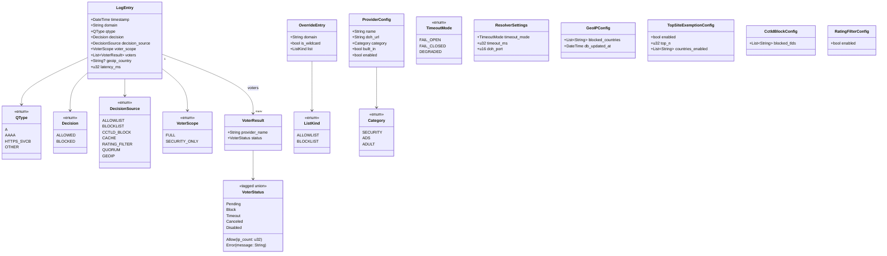

SOURCES: SPEC.md §5, §5.1, §5.1.1, §5.2, §5.3, §6, §8, §3.3, §3.4, §3.5, §4.

# DTO-модель каналу UI ↔ Backend

Типи, що перетинають Tauri IPC-міст (§8: "тільки DTO, призначені для UI",
internally tagged enum через serde, дзеркальний до TS discriminated union).
Не внутрішні структури бекенду (`CacheEntry` тощо) — ті не експонуються.

## Розбіжність у джерелі — вирішено, див. DECISIONS.md

SPEC.md §6 (структура запису логу) перелічує значення `voters` як
`BLOCK/ALLOW/TIMEOUT/ERROR/CANCELED` — п'ять варіантів. SPEC.md §8 (DTO
`VoterStatus`) перелічує `Pending/Block/Allow{ip_count}/Error{message}/Canceled` —
теж п'ять, але `TIMEOUT` замінено на `Pending`, і жодного `TIMEOUT` серед них.
Ці два переліки не збігаються буквально.

**Інтерпретація, застосована в діаграмі вище (не факт із джерела — припущення,
яке слід підтвердити чи виправити):** `Pending` — транзитний, лише-в-UI стан
("апстрім ще не відповів", видимий, поки лог оновлюється наживо через event від
бекенду), а `Timeout` — термінальний стан, що потрапляє у вже завершений
`LogEntry` після того, як таймаут (§3.3) стався. Тобто повна об'єднана множина —
**шість** варіантів: `Pending, Block, Allow(ip_count), Timeout, Error(message),
Canceled`, а не п'ять з жодного зі списків окремо.

**Сьомий варіант, `Disabled` (T-148, код, не SPEC.md)**: `crates/dnsqb-service/src/quorum.rs`'s
`VoterVerdict` виріс до шести бекенд-варіантів (`Block/Allow/Timeout/Error/Canceled/Disabled`) —
`Disabled` означає "провайдер адміністративно вимкнений цього разу, взагалі не опитувався"
(`quorum::EnabledProviders`), відмінний і від `Canceled` (був придатний, просто не дочекались), і
від `Timeout` (питали, не відповів). На відміну від `Pending`, тут нема зворотної асиметрії —
`Disabled` термінальний в обох напрямках (бекенд і DTO), додано в `VoterStatus` вище напряму, без
окремого пояснення-мапінгу. `ProviderConfig.enabled: bool` (DTO вище) вже передбачав саме цей
перемикач для майбутнього UI (T-52/T-53) — нова backend-можливість узгоджується з уже
запланованою формою DTO, не суперечить їй.

Це узгоджується з рештою §3.3 (три режими таймауту — там `TIMEOUT` явно
згадується як результат) і з §3.6 (`CANCELED` явно відрізняється від `TIMEOUT`
за визначенням: "не дочекано, бо рішення вже ухвалене", а не "не встиг
відповісти"). Але сам SPEC.md ніде прямо не пише "ось усі шість
варіантів разом" — це синтез двох окремих переліків, зроблений тут вперше.

**Вирішено [2026-08-25](../DECISIONS.md)** — підтверджено користувачем: 6
варіантів, `Pending` лишається окремим легітимним варіантом (зарезервований під
майбутнє live-відображення), а не хиба §8. SPEC.md §6/§8 лишаються буквально
розбіжними в тексті; DECISIONS.md — джерело істини для цієї розбіжності.

## ⚠️ GAP — `VoterScope` більше не однозначний (SPEC.md §5.1.1, T-138)

Діаграма вище все ще показує `VoterScope` як два варіанти (`FULL`/
`SECURITY_ONLY`), точно за поточним текстом SPEC.md §6/§8 — це не помилка
діаграми, джерело справді ще не змінено. Але SPEC.md §5.1.1 (доданий після
попередньої звірки) описує **другу, окрему причину** отримати
`SECURITY_ONLY` — особистий локально навчений список (5.1.1), не лише
курований топ-список країни (5.1) — і сам явно позначає це як невирішену
DTO-прогалину: `SECURITY_ONLY` у логу більше не каже, яке з двох джерел
спрацювало.

**Не патчено тут самовільно** (за правилом ritual'у вище — джерело
неоднозначне, не діаграма застаріла). Коли T-138 вирішить форму (третій
варіант enum'а, чи окреме поле-джерело поруч із `voter_scope`) — оновити
`VoterScope`-клас і зв'язок `LogEntry --> VoterScope` тут відповідно до
факту, ухваленого в SPEC.md/TASKS.md, а не заздалегідь.
