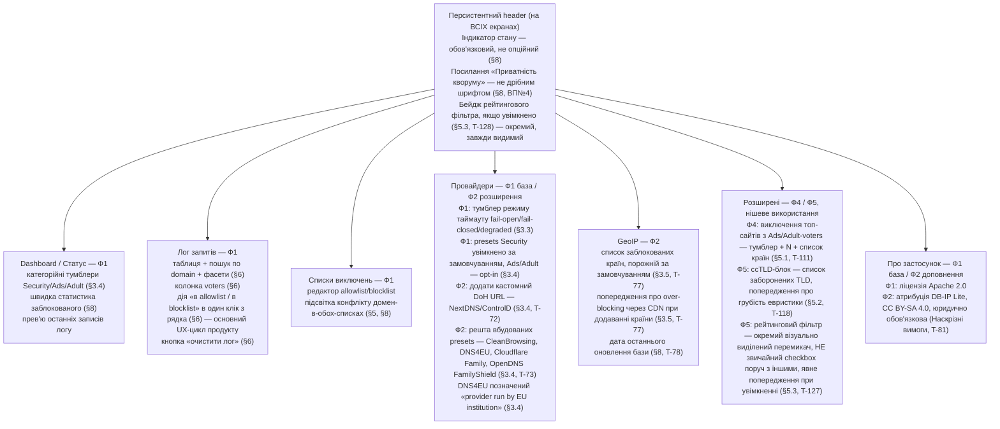

SOURCES: SPEC.md §6, §8, §8.1, §3.3, §3.4, §3.5, §5, §5.1, §5.2, §5.3, "Наскрізні вимоги"
(DB-IP Lite атрибуція), "Відкриті питання" №4 і №10; TASKS.md T-47, T-52, T-56, T-57, T-72,
T-77, T-78, T-81, T-111, T-118, T-127, T-128.

# Навігація / інформаційна архітектура GUI

Структура вкладок і те, що на кожній обов'язково є — не порядок кліків користувача
(це не user-flow діаграма), а інвентар екранів з прив'язкою до розділів SPEC.md,
звідки взята кожна вимога.

## Примітка щодо пріоритету розміщення

Лог запитів (§6: «основний UX-цикл продукту») і Dashboard — найвищий пріоритет
видимості, не глибша вкладка налаштувань. Advanced-вкладка (Ф4/Ф5) — свідомо
останньою в списку вкладок: SPEC.md сам характеризує ці фічі як нішеві
(«рідковживана функція», §5.3) і пізніші фази.

## ⚠️ GAP

SPEC.md не визначає порядок вкладок явно (це UI-компонування, не протокольна
поведінка) — послідовність вище є інтерпретацією за принципом «найчастіше
вживане — найвище» (§6, §8), а не фактом, вичитаним із джерела. Позначено тут
чесно замість видавання за задокументоване рішення.
