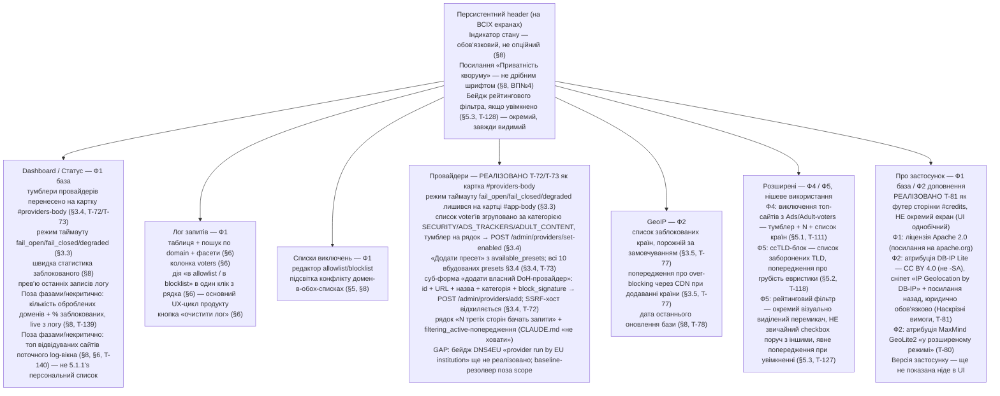

SOURCES: SPEC.md §6, §8, §8.1, §3.3, §3.4, §3.5, §5, §5.1, §5.1.1, §5.2, §5.3, "Наскрізні вимоги"
(DB-IP Lite атрибуція), "Відкриті питання" №4, №10, №11; TASKS.md T-47, T-52, T-56, T-57, T-72,
T-73, T-77, T-78, T-81, T-111, T-118, T-127, T-128, T-138, T-139, T-140.

# Навігація / інформаційна архітектура GUI

Структура вкладок і те, що на кожній обов'язково є — не порядок кліків користувача
(це не user-flow діаграма), а інвентар екранів з прив'язкою до розділів SPEC.md,
звідки взята кожна вимога.

## Примітка щодо пріоритету розміщення

Лог запитів (§6: «основний UX-цикл продукту») і Dashboard — найвищий пріоритет
видимості, не глибша вкладка налаштувань. Advanced-вкладка (Ф4/Ф5) — свідомо
останньою в списку вкладок: SPEC.md сам характеризує ці фічі як нішеві
(«рідковживана функція», §5.3) і пізніші фази.

## ⚠️ GAP — вкладок немає, це інвентар вимог, не карта реалізації

Реальний `/admin/ui` (T-149) — одна сторінка з картками (status, providers,
overrides, cache, geoip, geoip-maxmind, log) плюс футер `#credits` (T-81), без
вкладкового шелу. Картка `providers` реалізована T-72/T-73; вузли
`Advanced`/`About` вище описують **вимоги SPEC.md до вмісту**, а не окремі
екрани, що існують сьогодні. `About` реалізовано частково (як футер, не екран).

## ⚠️ GAP

SPEC.md не визначає порядок вкладок явно (це UI-компонування, не протокольна
поведінка) — послідовність вище є інтерпретацією за принципом «найчастіше
вживане — найвище» (§6, §8), а не фактом, вичитаним із джерела. Позначено тут
чесно замість видавання за задокументоване рішення.

## ⚠️ GAP — 5.1.1 (T-138) не додано до вузла Advanced

SPEC.md §5.1.1 описує другий, персональний варіант топ-N-виключення (той
самий механізм, що §5.1's тумблер у вузлі `Advanced` вище, T-111) — але
T-138 не визначає власного UI-контролу (тумблер? окрема секція? частина
того самого §5.1-тумблера?), і `UI-SPEC.md` не має рядка для нього. Додавати
вузол/підпис тут означало б вигадати форму контролу, якої джерело ще не
називає — за правилом ritual'у вище це порушення, не акуратність. Оновити
цей вузол, коли T-138 (чи його UI-задача) зафіксує конкретний контрол.
