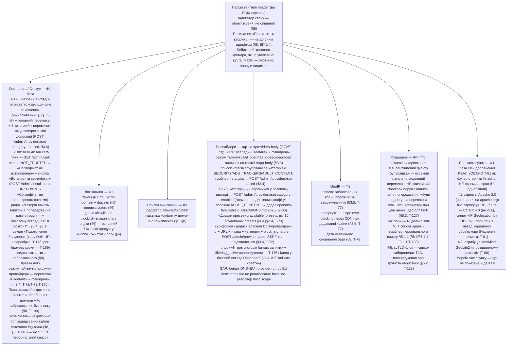

SOURCES: SPEC.md §6, §8, §8.1, §3.3, §3.4, §3.5, §5, §5.1.1, §5.2, §5.3, "Наскрізні вимоги";
DECISIONS.md 2026-09-07 (T-179 — §5.1 прибрано, рейтинг-фільтр Ф5→Ф4); `diagrams/rating-filter.md`
(DB-IP Lite атрибуція), `diagrams/onboarding.md` (майстер першого запуску, T-188), "Відкриті
питання" №4, №10, №11; TASKS.md T-47, T-52, T-56, T-57, T-72, T-73, T-77, T-78, T-81, T-111,
T-118, T-127, T-128, T-138, T-139, T-140, T-176, T-188; UI-SPEC.md §2.1;
DECISIONS.md 2026-09-06 (T-176), 2026-09-08 (T-188 — онбординг); mockups/gui-dashboard.html.

# Навігація / інформаційна архітектура GUI

Структура вкладок і те, що на кожній обов'язково є — не порядок кліків користувача
(це не user-flow діаграма), а інвентар екранів з прив'язкою до розділів SPEC.md,
звідки взята кожна вимога.

## Примітка щодо пріоритету розміщення

Лог запитів (§6: «основний UX-цикл продукту») і Dashboard — найвищий пріоритет
видимості, не глибша вкладка налаштувань. Advanced-вкладка (Ф4/Ф5) — свідомо
останньою в списку вкладок: SPEC.md сам характеризує ці фічі як нішеві
(«рідковживана функція», §5.3) і пізніші фази.

## ⚠️ GAP — вкладок немає, це інвентар вимог, не карта реалізації

Реальний `/admin/ui` (T-149) — **одна сторінка**, без вкладкового шелу. Вузли
діаграми вище — інвентар вимог SPEC.md до вмісту, не окремі екрани.

**Фактична розкладка після T-176** (макет: `mockups/gui-dashboard.html`,
UI-SPEC.md §2.1): два рівні на одній сторінці —
- **базовий вигляд** — hero-статус, головний + 3 категорійні перемикачі,
  privacy-рядок, pass-through-попередження, статистика, прев'ю логу, секція
  «Підключення браузера», футер `#credits` (T-81);
- **`
` «Розширені налаштування»** (згорнуто) — картки `providers`,
  `cache`, `geoip`, `geoip-maxmind`, режим таймауту, `danger-zone`. ID карток
  і їхня `main.js`-логіка без змін; T-176 їх лише загорнув.

Картка `providers` реалізована T-72/T-73; `About` — частково (футер `#credits`,
не екран). Вузли `Advanced` (Ф4: рейтинг-фільтр «бульбашка» + зони; Ф5:
ccTLD-блок) — усе ще вимоги SPEC.md, не існують; не плутати з `
`
«Розширені» T-176, який лише переховує наявні технічні картки.

## ⚠️ GAP

SPEC.md не визначає порядок вкладок явно (це UI-компонування, не протокольна
поведінка) — послідовність вище є інтерпретацією за принципом «найчастіше
вживане — найвище» (§6, §8), а не фактом, вичитаним із джерела. Позначено тут
чесно замість видавання за задокументоване рішення.

## Примітка — §5.1 прибрано (T-179, 2026-09-07)

Попередня редакція вузла `Advanced` мала окремий тумблер «виключення топ-сайтів
з Ads/Adult-voters» (§5.1) + ⚠️ GAP про те, що §5.1.1 (T-138) не має власного
контролу. §5.1 знято (DECISIONS.md 2026-09-07): механізм топ-сайтів злито в
рейтинговий фільтр §5.3, а §5.1.1 переформульовано як персональне джерело зон
цього фільтра. Вузол `Advanced` вище оновлено відповідно: рейтинг-фільтр +
зони (N, країни, персональний список §5.1.1 — тумблер, дефолт OFF). Детальна
поведінка фільтра — `diagrams/rating-filter.md`.
