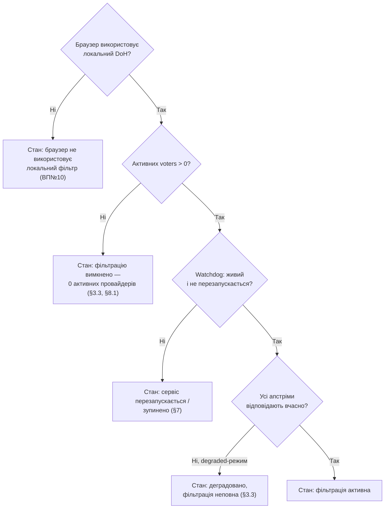

SOURCES: SPEC.md §8, §8.1, §3.3, §5.3, §7; "Відкриті питання" №10; CLAUDE.md
(dns-quorum-filter) "Ключові нетривіальні рішення"; TASKS.md T-56, T-91, T-95, T-128.

# Індикатор стану — умови, не автомат переходів

Навмисно НЕ stateDiagram. Причина: умови нижче — незалежні один від одного
булеві/переліковані прапорці бекенду (браузер використовує локальний DoH чи
ні; активних voters 0 чи >0; деградація апстрімів; стан watchdog), а не кроки
одного процесу з чіткими переходами між ними. SPEC.md ніде не описує їх як
automaton — примусове зведення в один stateDiagram було б згладжуванням, якого
прямо забороняє ground-truth ritual ("не згладжуй асиметричну структуру в
охайну діаграму").

## Основний індикатор (одна умова показується одночасно — див. GAP нижче)

| # | Умова | Джерело | Текст стану |
|---|-------|---------|-------------|
| 1 | Браузер фактично НЕ використовує локальний DoH | ВП№10 | "Браузер не використовує локальний DNS-фільтр" — діагностика постфактум, не запобігання |
| 2 | Активних voters = 0 (усі провайдери вимкнені) | §3.3, §8.1 | "Фільтрацію вимкнено — жодного активного провайдера" — явний pass-through, не помилка |
| 3 | Деградація: N з M апстрімів не відповіли, режим `degraded` | §3.3 | "Деградовано: фільтрація неповна (N/M апстрімів не відповідають)" |
| 4 | Watchdog: процес перезапускається / ліміт спроб вичерпано | §7, T-91, T-95 | "Сервіс перезапускається" / "Сервіс зупинено — перевищено ліміт спроб перезапуску" |
| 5 | Жодна з умов 1-4 не виконана | — | "Фільтрація активна" |

## Окремий, паралельний елемент — бейдж рейтингового фільтра

Не частина основного індикатора вище. §5.3 і T-128 вимагають **окремий,
завжди видимий** індикатор активності рейтингового фільтра — це друге, не
альтернативне, UI-повідомлення: показується одночасно з будь-яким станом
основного індикатора, коли `RatingFilterConfig.enabled = true` (Ф5).

## Звужена реалізація T-56 (2026-08-29) — не повна версія цієї діаграми

Ф1 closure-план (TASKS.md) звузив T-56 до простішого попередника в `dnsqb-tray`'s tooltip
(`crates/dnsqb-tray/src/status.rs`), не до повного індикатора вище. Реалізовано: умова 2 (0
voters — уже готове з T-149, `NoActiveProvider`; T-72/T-73 змінило вхід із
`AdminStatusResponse.providers` (2 булі) на `active_providers: ProviderStatusView[]` — стан
`NoActiveProvider` = порожній масив, семантика та сама) і частина умови 3 (деградація — `AdminStats.
degraded_window`/`degraded_events`, `diagrams/ui-dto-model.md`'s власний новий розділ). Умова 1
(браузер не використовує локальний DoH — блокована на T-134's ще не спроєктованому
domain→fixed-IP canary-механізмі) і умова 4 (watchdog — Фаза 3 ще не існує) лишаються
нереалізованими; ця діаграма й далі описує повну майбутню ціль, не переписана під звужену
реалізацію. Порядок пріоритету з GAP нижче свідомо оминуто, не проігноровано: у звуженій
реалізації "деградація" — це суфікс до стану `Filtering`, а не окрема конкуруюча умова
верхнього рівня, тож рішення про порядок їй не потрібне. GAP лишається чинним для T-95 і для
повної версії індикатора (умови 1/2/3/4 як окремі стани) — рішення про порядок все ще потрібне
перед тим.

## ⚠️ GAP — порядок пріоритету при одночасному виконанні кількох умов

Flowchart вище встановлює порядок перевірки (1 → 2 → 3 → 4), **але це не
задокументоване в SPEC.md рішення, а рекомендація, введена тут вперше**, щоб
було з чого починати реалізацію. SPEC.md не каже, що показувати, якщо,
наприклад, watchdog одночасно перезапускається І активних voters 0.
Обраний тут порядок (спочатку найгірше з погляду користувача — "браузер
взагалі не фільтрується" — тоді явний вибір користувача — тоді
інфраструктурна проблема — тоді часткова деградація) — логічне припущення,
не факт джерела. Потребує підтвердження чи явного запису в DECISIONS.md
перед реалізацією T-56/T-95.
