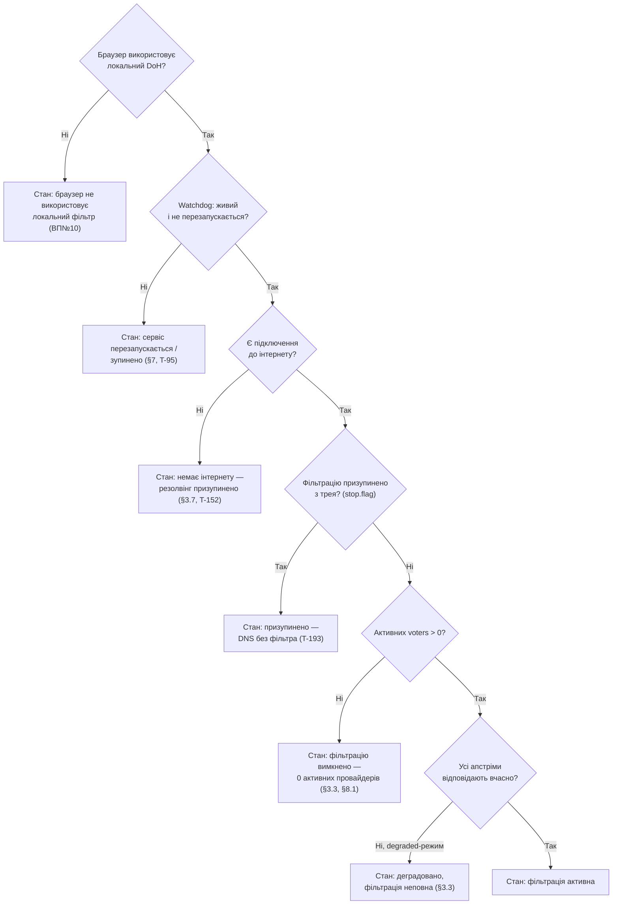

SOURCES: SPEC.md §8, §8.1, §3.3, §3.7, §5.3, §7; "Відкриті питання" №10; CLAUDE.md
(dns-quorum-filter) "Ключові нетривіальні рішення"; TASKS.md T-56, T-91, T-95, T-111, T-127,
T-128, T-152, T-176, T-188, T-191, T-193, T-196; SERVICES.md §dnsqb-tray "Іконка", "Онбординг першого запуску",
"Меню"; UI-SPEC.md §2.1, §3.1; `diagrams/onboarding.md`, `diagrams/process-lifecycle.md`;
DECISIONS.md 2026-09-02, 2026-09-03, 2026-09-08 (T-191 — колір іконки; T-188 — онбординг +
hero cert-гілка; T-193 — пауза = нефільтрований baseline + `AdminStatusResponse.paused`).

# Індикатор стану — умови, не автомат переходів

Навмисно НЕ stateDiagram. Причина: умови нижче — незалежні один від одного
булеві/переліковані прапорці бекенду (браузер використовує локальний DoH чи
ні; активних voters 0 чи >0; деградація апстрімів; стан watchdog), а не кроки
одного процесу з чіткими переходами між ними. SPEC.md ніде не описує їх як
automaton — примусове зведення в один stateDiagram було б згладжуванням, якого
прямо забороняє ground-truth ritual ("не згладжуй асиметричну структуру в
охайну діаграму").

## Основний індикатор (одна умова показується одночасно; порядок пріоритету — DECISIONS.md 2026-09-02, 2026-09-03)

| # | Умова | Джерело | Текст стану |
|---|-------|---------|-------------|
| 1 | Браузер фактично НЕ використовує локальний DoH | ВП№10 | "Браузер не використовує локальний DNS-фільтр" — діагностика постфактум, не запобігання |
| 2 | Watchdog: процес перезапускається / ліміт спроб вичерпано | §7, T-91, T-95 | "Сервіс перезапускається" / "Сервіс зупинено — перевищено ліміт спроб перезапуску" |
| 3 | Немає інтернету (усі маркери досяжності впали) | §3.7, T-152 | "Немає підключення до інтернету — резолвінг призупинено" — офлайн-швидкий-шлях активний |
| 3a | Фільтрацію призупинено з трея (`stop.flag` / `AdminStatusResponse.paused`) | §7 T-185/T-193 | "Фільтрацію призупинено — DNS без фільтра" — служба жива, віддає нефільтрований baseline (квор. + GeoIP обходяться; власні списки діють) |
| 4 | Активних voters = 0 (усі провайдери вимкнені) | §3.3, §8.1 | "Фільтрацію вимкнено — жодного активного провайдера" — явний pass-through, не помилка |
| 5 | Деградація: N з M апстрімів не відповіли, режим `degraded` | §3.3 | "Деградовано: фільтрація неповна (N/M апстрімів не відповідають)" |
| 6 | Жодна з умов 1-5 не виконана | — | "Фільтрація активна" |

Порядок 1→2→3→3a→4→5: спочатку найгірше (браузер узагалі не фільтрується), тоді інфраструктурний/
середовищний збій — спершу сам сервіс (watchdog), тоді мережа (офлайн), — тоді свідома пауза
користувача, тоді явний конфіг-вибір (0 voters), тоді часткова деградація. **watchdog вище за
0-voters** — DECISIONS.md 2026-09-02; **офлайн між watchdog і 0-voters** — DECISIONS.md
2026-09-03; **пауза (3a) між офлайн і 0-voters** у конвеєрі/hero — DECISIONS.md 2026-09-08 (T-193;
офлайн виграє, бо baseline теж недосяжний). **У трей-tooltip'і `Paused` навпаки ранжується вище
за все** (свідома дія має читатись як така, не як збій) — навмисна розбіжність, як з cert-override
нижче.

## Окремий, паралельний елемент — бейдж рейтингового фільтра

Не частина основного індикатора вище. §5.3 і T-128 вимагають **окремий,
завжди видимий** індикатор активності рейтингового фільтра — це друге, не
альтернативне, UI-повідомлення: показується одночасно з будь-яким станом
основного індикатора, коли `AdminStatusResponse.rating_filter.enabled = true`.
**Збудовано Батч 4.4 (T-128):** конвеєр — T-124/Батч 4.3; поле статусу
(`RatingFilterStatusView { enabled, active, lists, available_lists, loaded }`),
`
` під hero (2-с полл, `renderRatingFilterBadge`
у `render()` — не застаріває; порожній `
`, коли вимкнено) з двома станами
(`active` → «активний»; `enabled && !active` Fork B → «увімкнено — списки
завантажуються») **плюс** суфікс у підказці трею `— рейтинг-фільтр «бульбашка»
активний` (`compose_tooltip`, **лише коли `active`**, після degraded-суфікса,
**колір іконки не чіпає** — вибір обсягу ≠ сигнал здоровʼя).

## Стан реалізації

- **Умова 2 (watchdog)** — реалізовано T-95 (Ф3 Батч 3.3): `dnsqb-tray`'s tooltip
  (`TrayStatus::{ServiceRestarting, ServiceGaveUp}`, `status::watchdog_override`) і поле
  `GET /admin/status.watchdog: Option<WatchdogStatusView>` (`dispatch::read_watchdog_view`), обидва
  читають `<app-data>/watchdog-state.json` (єдиний письменник — `dnsqb-watcher`, §7.1 #7); стале
  (`mtime` старіше за 3 інтервали) / відсутнє / проміжний стан → `None`.
- **Умова 3 (немає інтернету)** — реалізовано T-152 (Ф3 Батч 3.4): `dnsqb-tray`'s tooltip
  (`TrayStatus::Offline`, перевіряється в `from_response` перед `NoActiveProvider`) і поле
  `GET /admin/status.network: NetworkStatusView` (`ONLINE`/`OFFLINE`); джерело — `run_reachability_prober`
  (кілька незалежних `generate_204`-маркерів, офлайн лише коли **всі** впали). Не годує `/health`
  чи watchdog-канали (обрив мережі не повинен виглядати як мертвий сервіс).
- **Умова 4 (0 voters)** — з T-149 (`NoActiveProvider`); T-72/T-73 змінило вхід на
  `active_providers: ProviderStatusView[]` (порожній масив = стан).
- **Частина умови 5 (деградація)** — `AdminStats.degraded_window`/`degraded_events`, суфікс до
  `Filtering` у tooltip (звужений T-56, 2026-08-29), не окрема конкуруюча умова верхнього рівня.
  T-155 розширив `degraded_counts` — рядки `BASELINE_FALLBACK` (усі фільтри мовчать) теж
  рахуються.
- **Умова 1 (браузер не використовує локальний DoH)** — не реалізовано, блоковано на T-134's ще
  не спроєктованому domain→fixed-IP canary-механізмі.
- **Hero-статус `/admin/ui` (T-176)** — базовий вигляд піднімає цей індикатор у єдиний великий
  блок угорі (UI-SPEC.md §3.1): «Захищено» (умова 6) / «Служба зупинилась» / «Відновлення…»
  (умова 2) / «Немає інтернету» (умова 3) / **«Фільтрацію призупинено» (умова 3a, T-193 —
  `status.paused`, `is-warn`)** / «Не захищено» (умова 4, або сервіс не відповідає). Той самий
  набір обчислюваних умов і той самий порядок пріоритету, що тут — T-176 **не змінює умови**,
  лише робить їх помітними нетех-користувачу. Умови 1 і 5 у hero не показуються
  (1 — не реалізована; 5 — лишається суфіксом-деградацією, як у трей-tooltip).
- **Пауза (умова 3a, T-193)** — реалізовано в конвеєрі й hero: `dnsqb-service` сам читає
  `stop.flag` (полер `pause_watch` → `AppState.filtering_paused`), `handle_query` віддає
  нефільтрований baseline тією ж гілкою, що й «0 voters» (без кешу). `GET /admin/status.paused`
  несе стан; `computeProtectionState` вставляє гілку `status.paused` **між** `OFFLINE` (умова 3)
  і 0-voters (умова 4). Трей-tooltip `TrayStatus::Paused` (читається прямо з `stop.flag`)
  навпаки ранжується вище за все — свідома пауза не має читатись як збій; навмисна розбіжність
  порядку hero-vs-tray (DECISIONS.md 2026-09-08).
- **Cert-гілка hero (T-188, Батч 3.13)** — `computeProtectionState(status, reachable, certTrust)`
  вставляє одну гілку **після** умови 4 (0 voters), **перед** «Захищено»: `certTrust ==
  NOT_TRUSTED` → `is-bad` «Сертифікат не встановлено» + кнопка «Встановити сертифікат»
  (`POST /admin/install-cert`); `certTrust == UNKNOWN` → `is-warn` «Сертифікат не перевірено»
  (окремо — `certutil` не відповів, «unknown ≠ untrusted»); `null` (ще не fetched) → гілка
  пропускається. Джерело — `GET /admin/cert-status` (`CertTrustView`), окремий fetch раз на
  завантаженні + після install-кліку, **не** на 2-с поллі. Це те саме, що робить override
  трей-іконки нижче, але для hero: cert-довіра — ортогональний вхід, не нова умова верхнього
  рівня й не зміна порядку 2026-09-02 / 09-03. Порядок відносно watchdog/network/0-voters той
  самий: cert-проблема нижча за них (сервіс досяжний, фільтрація йде — cert лише робить
  браузерний DoH ненадійним).

Повна версія індикатора (умови 1–5 як окремі конкуруючі стани з єдиним індикатором, не суфіксом)
— майбутня; ця діаграма описує її як ціль. Порядок пріоритету при одночасному виконанні — нижче,
закрито.

## Колір трей-іконки (T-191, Батч 3.14)

**Це рендер драбини вище, не нова умова.** `dnsqb-tray` показує один із 4 кольорових гліфів
(green / amber / grey / red) замість єдиної статичної білої іконки (T-183). Вхід — той самий
`TrayStatus`, який дає драбина, **плюс** `cert_trusted: bool` як другий *ортогональний* вхід
(read-only `trust_store::is_trusted`, окремий тред). Жодної нової умови верхнього рівня, жодної
зміни порядку пріоритетів 2026-09-02 / 2026-09-03 — узгоджується з тезою цього файлу
(«незалежні прапорці, не automaton»).

Чиста тотальна `status::icon_colour(TrayStatus, cert_trusted) -> IconColour`:

| `TrayStatus` | `cert_trusted` | Колір |
|---|---|---|
| `Filtering` (`degraded_events < degraded_window`, у т.ч. `== 0`) | так | 🟢 green |
| `Filtering` (`degraded_events == degraded_window > 0` — всі останні quorum-запити деградували, T-196) | так | 🟡 amber |
| `ServiceRestarting` / `Offline` | будь-яке | 🟡 amber |
| `NoActiveProvider` / `Paused` | так | ⚪ grey |
| `Unreachable` / `ServiceGaveUp` | будь-яке | 🔴 red |
| `Filtering` (будь-яка degraded) | **ні** | 🔴 red (override) |
| `NoActiveProvider` / `Paused` / `Offline` / watchdog | **ні** | без override — колір рядка вище |

**Override cert-not-trusted → red фліпає лише `Filtering`** (DECISIONS.md 2026-09-08): SPEC §3/§8.1
вимагає показувати `NoActiveProvider` як окремий стан, **не помилку** (умова 4 вище — «явний
pass-through, не помилка»); `Paused` — свідомий вибір (T-185, регресійний тест). Для цих станів
проблему недовіреного сертифіката несе **tooltip-суфікс** `status::cert_warning` /
`compose_tooltip` (той самий прийом, що degraded-суфікс умови 5), а не червоний гліф — щоб червона
іконка не стояла поряд із tooltip «захищає».

**T-196 (Батч 3.14):** `Filtering` іде amber лише коли `degraded_events == degraded_window` (усі
останні quorum-запити деградували → фільтрація фактично не відбувається). Частковий лічильник —
відновлений блип: іконка лишається зеленою, суфікс умови 5 у тултіпі несе «N/M останніх». До
T-196 один тайм-аут апстріма застрягав жовтим на весь таскбар на ~20 запитів.

Реалізовано T-191 (Батч 3.14): `status::icon_colour` / `cert_warning` / `compose_tooltip`
(`crates/dnsqb-tray/src/status.rs`, чисті + свої тести); `TrustState` / `spawn_trust_watch`
(окремий тред, `trust_store::is_trusted`; показуваний прапор seed `true`, каденс `next_delay`
ключиться на підтверджений `Ok(true)` — `Err`/`Ok(false)` беруть драбину `2→5→15→60→300` с);
`main.rs` — `refresh_tray` (tooltip на зміну `(observed, trusted)`, `set_icon` на зміну кольору,
комміт `last_colour` лише на `Ok`). 4 гліфи — `assets/gen-icon.py` `make_tray_glyph(size, colour)`.

## Закрито — порядок пріоритету при одночасному виконанні кількох умов (DECISIONS.md 2026-09-02)

Раніше ⚠️ GAP. SPEC.md не фіксував, що показувати, коли, наприклад, watchdog перезапускається
**І** активних voters 0. **Рішення (прохання користувача 2026-09-02):** порядок
`1 (браузер) → 2 (watchdog) → 3 (0 voters) → 4 (деградація) → 5 (активна)` — **watchdog вище за
0-voters**, бо інфраструктурний збій сервісу робить фільтрацію недоступною незалежно від
конфігурації. Повний запис і наслідки — `DECISIONS.md` 2026-09-02.
