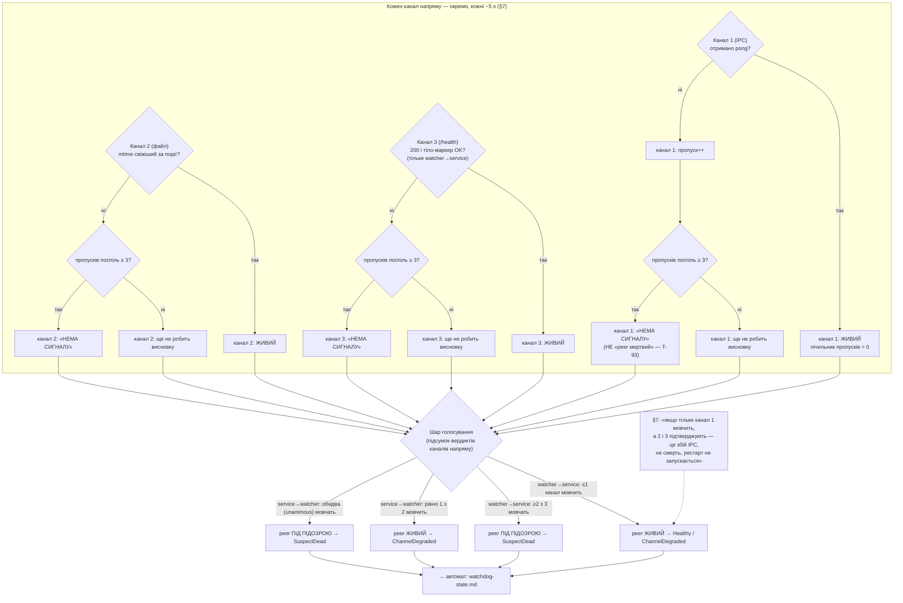

SOURCES: SPEC.md §7 (вкл. §7.1 — реалізаційні рішення Ф3 Батч 3.0); TASKS.md T-84, T-85,
T-86, T-87, T-88, T-93, T-94; `diagrams/watchdog-state.md` (автомат, який споживає підсумок
голосу).

# Watchdog — три канали живучості та шар голосування

Навмисно **flowchart, не stateDiagram**: три канали — незалежні джерела сигналу, кожен зі
своїм failure mode й окремим лічильником пропусків, а не кроки одного процесу (той самий
принцип, що `ui-status-indicator.md` — не форсувати automaton там, де умови незалежні). §7:
«три незалежні канали, кожен зі своїм failure mode, замість одного — щоб збій самого каналу
зв'язку не був хибно прийнятий за смерть процесу».

## Канали (§7, таблиця в тілі розділу 7)

| # | Канал | Транспорт | Напрями | Що перевіряє |
|---|-------|-----------|---------|--------------|
| 1 | IPC heartbeat | Windows: named pipe (`tokio::net::windows::named_pipe`, §7.1 #1); **сервер = `dnsqb-service`, клієнт = `dnsqb-watcher`**, один дуплексний pipe, ping/pong обох напрямів на ньому. Unix Ф6: domain socket | обидва | ping/pong, найшвидший; слабке місце «осиротілий сокет» з §7 — **Unix-only** (pipe Windows — kernel-об'єкт без ФС-артефакту, §7.1 #1) |
| 2 | Shared heartbeat-файл | періодичний `mtime`-touch файлу в app-data; **лише `mtime`**, staleness = `now − mtime > поріг` (§7.1 #4) | обидва | не залежить від сокет-дескрипторів; найпростіший, переживає збій IPC-стеку |
| 3 | HTTP `GET /health` | ендпоінт на вже відкритому DoH-порту (`127.0.0.1:<port>/health`) — **не новий слухач**. Довіра до self-signed cert — через `AdminClient` (читає `cert.pem`, ніколи `danger_accept_invalid_certs`), перебудова на (пере)конекті через T-69-ротацію (§7.1 #10) | **лише watcher → service** | глибша за «процес існує»: DoH-слухач приймає, `AppState` читається, локально-термінальний pipeline-шлях повертає. **Жодного upstream DoH-виклику** (§7.1 #4 / #10) |

## Потік: сирий сигнал → вердикт каналу → голос → автомат

## Незалежні виноски (не гілки автомата)

- **`/health` не робить жодного upstream DoH-виклику** (§7.1 #4). Інакше обрив інтернету
  завалив би канал 3 при живому сервісі; з одночасно деградованими 1–2 це дало б рестарт на
  мережевому збої — саме той false positive, від якого мультиканальність §7 і захищає.
  Питання «чи є взагалі інтернет» — окремий механізм, Батч 3.4 (T-152), не канал 3.
- **Поріг 3 пропуски поспіль — по кожному каналу окремо** (§7), тоді голос. Один вдалий
  pong/touch/200 скидає лічильник цього каналу в 0.
- **Найважливіший тест модуля** (§7, T-93): «канал N недоступний, peer живий → канал N каже
  ‹нема сигналу›, сам не робить висновку ‹смерть›». Тобто вузли `C{n}silent` вище ведуть **у
  шар голосування**, а не напряму в рестарт. End-to-end варіант того самого («один канал
  мовчить + два живі → голос каже ЖИВИЙ, рестарту немає») — теж T-93, тестується на рівні
  `Vote` у Батчі 3.2.
- **`service → watcher` має лише 2 канали** (немає `/health` у watcher'а — §7), тому там
  потрібен **unanimous**, не більшість: «рівно 1 з 2 мовчить» = ЖИВИЙ, не рестарт.

## ⚠️ GAP — SPEC не фіксує

- Чи ділять напрями watcher→service і service→watcher **одну** ~5 s фазу опитування, чи мають
  незалежні таймери. §7 каже «інтервал узгоджений між усіма трьома каналами (~5 с)» — про
  узгодження між *напрямами* не сказано. Прийнято в §7.1: спільний 5 s тик, обидва напрями в
  ньому.

## Закрито

- **Форма «тіло-маркер OK» для `/health`** — закрито T-86 (Батч 3.1). «Здоровий» = **сам
  HTTP 200**; тіло `admin::HealthResponse { active_providers: usize, geoip: LOADED|ABSENT }` —
  інформаційне, не gate. Канал 3 проходить, коли `AdminClient::health()` віддає 200 **і** тіло
  декодується як `HealthResponse` (garbage-тіло на 200 → `Err` → «нема сигналу»). `serve_health`
  прогонить локальний префікс pipeline (override + cache lookup для sentinel-домену
  `health-probe.dnsqb.invalid`, обидва мережево-вільні) — це і є «глибша за ‹процес існує›, без
  upstream» (§7.1 #4/#10).
