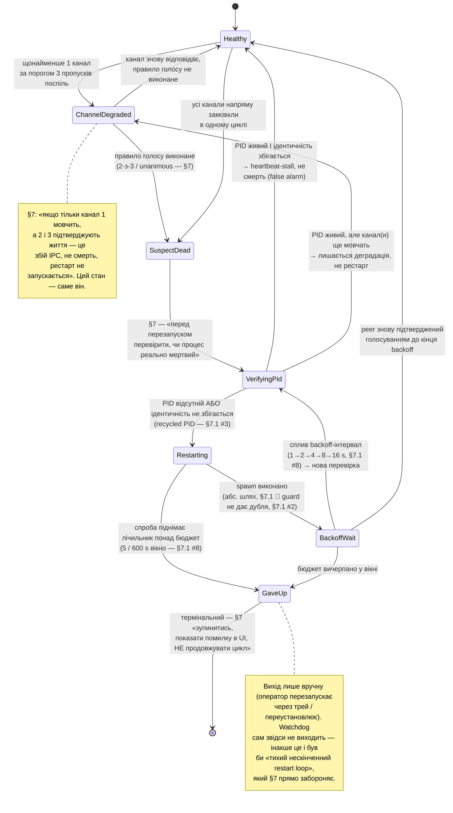

SOURCES: SPEC.md §7 (вкл. §7.1 — реалізаційні рішення Ф3 Батч 3.0); TASKS.md T-87, T-88,
T-89, T-90, T-91, T-92, T-93, T-94, T-95, T-150 (Батч 3.2 реалізував цей автомат у
`watchdog::transition` — код конформує до діаграми, не змінює її); `diagrams/watchdog-channels.md`
(шар каналів, що годує цей автомат); `diagrams/ui-status-indicator.md` (умова 4 — як цей стан
показується в UI).

# Watchdog — автомат живучості / рестарту (на напрям)

Один і той самий автомат виконується **двічі, незалежно**: напрям «watcher перевіряє
service» і напрям «service перевіряє watcher». Різниця між ними — не в станах, а в тому, що
їх живить (див. `watchdog-channels.md`):

| Напрям | Канали | Правило голосу (§7) | Хто рестартує кого |
|--------|--------|---------------------|--------------------|
| watcher → service | 1 (IPC), 2 (файл), 3 (`/health`) | **2-з-3** мовчать | watcher піднімає `dnsqb-service` |
| service → watcher | 1 (IPC), 2 (файл) | **unanimous** — обидва мовчать | service піднімає `dnsqb-watcher` |

`GaveUp` — **per-target** (§7.1 #8): бюджет і лічильники в кожного напряму свої.

## Стани — трасування до §7 / §7.1

| Стан | Джерело |
|------|---------|
| `Healthy` | голосування по каналах напряму підтверджує життя peer'а |
| `ChannelDegraded` | §7: ≥1 канал за порогом 3 пропусків поспіль, але правило голосу ще НЕ виконане — «збій IPC, не смерть» |
| `SuspectDead` | §7: правило голосу виконане (2-з-3 для watcher→service; unanimous для service→watcher) |
| `VerifyingPid` | §7: «перед перезапуском — перевірити, чи процес реально мертвий за PID… Відсутність heartbeat ≠ мертвий процес». §7.1 #3: перевірка = **PID + ідентичність** (exe-шлях / ім'я процесу проти `<role>.pid`), ніколи PID окремо — recycled PID інакше читався б як «живий назавжди», тихий вічний збій гірший за restart loop |
| `Restarting` | §7: перезапуск відсутнього процесу. §7.1 #5: spawn абсолютним шляхом з `current_exe().parent()`, ніколи PATH. §7.1 #2: single-instance guard не дає підняти другий екземпляр поруч із живим |
| `BackoffWait` | §7: «експоненційний backoff між спробами перезапуску». §7.1 #8: 1→2→4→8→16 s (cap 16 s) |
| `GaveUp` | §7: «ліміт спроб у вікні часу (напр. 5 за 10 хв) → далі зупинитись, показати помилку в UI, не продовжувати цикл». §7.1 #8: 5 / 600 s, per-target. Термінальний |

## Переходи, яких SPEC прямо не називає — інтерпретація, позначено чесно

- **`Healthy` → `SuspectDead` напряму** (усі канали замовкли в одному циклі, без проходу через
  `ChannelDegraded`): §7 описує поріг «3 пропущені поспіль по кожному каналу окремо», тобто
  деградація каналу завжди передує голосу. Прохід «повз» `ChannelDegraded` намальовано для
  повноти автомата (усі канали перетнули поріг одночасно), не як окремо описаний у §7 сценарій.
- **`VerifyingPid` → `ChannelDegraded`** (PID живий, але канали ще мовчать): §7 каже лише «PID
  живий → не рестартувати». Куди саме повернутись — назад у деградацію (канали ще мовчать) чи в
  `Healthy` — виведено з логіки станів, не з тексту §7.
- **Точні числа** backoff (1→2→4→8→16 s) і бюджету (5 / 600 s): §7 дає «експоненційний» і «напр.
  5 за 10 хв» — §7.1 #8 фіксує їх як дефолти Ф3 (не конфігуровані в Ф3), не як факт, вичитаний
  дослівно з §7.

## Крос-посилання на UI

`diagrams/ui-status-indicator.md` умова 4 — «Сервіс перезапускається» / «Сервіс зупинено —
перевищено ліміт спроб перезапуску». Мапінг: `Restarting` / `BackoffWait` → «перезапускається»;
`GaveUp` → «зупинено, ліміт вичерпано». `Healthy` / `ChannelDegraded` / `SuspectDead` /
`VerifyingPid` UI окремо не показує (проміжні, суб-секундні–секундні). Поле-носій —
`/admin/status.watchdog: WatchdogStatusView` (§7.1 #7), реалізація в Батчі 3.3 / T-95.
